# Architecture — Vulnerability Triage & Patch-Suggestion Harness

A deterministic, leakage-safe, air-gapped pipeline for vulnerability triage and
patch suggestion. The harness processes NVD/CVE security reports through an
11-stage pipeline, producing fine-tuned LLMs that classify CWEs and emit minimal
unified-diff patches verified by an executable sandbox.

## Table of Contents

1. [Design Principles](#design-principles)
2. [Technology Stack](#technology-stack)
3. [Data Layer](#data-layer)
4. [The 11-Stage Pipeline](#the-11-stage-pipeline)
   - [Stage 1: Data Collection](#stage-1-data-collection)
   - [Stage 2: Cleaning, Dedup & Leakage-Safe Split](#stage-2-cleaning-dedup--leakage-safe-split)
   - [Stage 3: Instruction Formatting](#stage-3-instruction-formatting)
   - [Stage 4: Baseline Evaluation](#stage-4-baseline-evaluation)
   - [Stage 5: Training](#stage-5-training)
   - [Stage 6: Four-Tier Evaluation](#stage-6-four-tier-evaluation)
   - [Stage 7: Regression & Forgetting](#stage-7-regression--forgetting)
   - [Stage 8: Quantization Matrix](#stage-8-quantization-matrix)
   - [Stage 9: Air-Gapped Serving](#stage-9-air-gapped-serving)
   - [Stage 10: CI Regression Gate](#stage-10-ci-regression-gate)
   - [Stage 11: Documentation & Demo](#stage-11-documentation--demo)
5. [Injectable Backend Pattern](#injectable-backend-pattern)
6. [Security](#security)
7. [CLI Reference](#cli-reference)
8. [Output Directory Layout](#output-directory-layout)

---

## Design Principles

| Principle | Implementation |
|---|---|
| **Zero-import-weight** | All heavy ML dependencies (`torch`, `transformers`, `peft`, `sentence-transformers`, `auto_gptq`, `autoawq`, `llama_cpp`, `httpx`, `docker`, `boto3`, `datasets`, `wandb`, `openai`) are lazy-loaded inside methods. The package `import app` cost is ~0.1 s. |
| **Injectable backends** | Every stage touches the outside world (model, embeddings, token counting, code execution, quantization, serving) through a `Protocol`. Mock implementations exist for every backend, enabling full CI validation without GPU or network. |
| **Leakage-safe** | Dataset splits are grouped by `repo_name` — samples from the same repository never appear in both train and eval, preventing memorization. Stage 2 also runs contamination checks. |
| **Air-gapped serving** | Stage 9 defaults to the `llama.cpp` GGUF backend with `host=0.0.0.0` and no external API calls. Ollama is available as an alternative. |
| **Defence in depth** | Path-traversal prevention (`app/security/paths.py`), log-injection sanitization (CRLF strip in `app/ci/gate.py`), Docker sandbox isolation (read-only FS, no network, non-root user, 512 MB RAM), and the `MissingAdapterWeightsError` guard against silent base-model fallback. |

---

## Technology Stack

| Layer | Tech |
|---|---|
| Orchestration | Python 3.11+, Typer CLI |
| Base model | Qwen2.5-Coder-7B-Instruct |
| Fine-tuning | SFT (full / QLoRA 4-bit NF4) + DPO |
| Quantization | GPTQ, SmoothQuant-AWQ, GGUF |
| Serving | llama.cpp (GGUF), Ollama, Transformers, FastAPI |
| Vector store | Embeddings for dedup + static-signal matching (dense cosine) |
| Storage (metadata) | PostgreSQL (`VulnSampleRow`, `TrainingRunRow`) |
| Storage (payloads) | MinIO / S3-compatible (`put_json`, `get_json`) |
| Storage (fallback) | Local JSON files under `output/stageN/` |
| CI | GitHub Actions, `app/ci/` regression gate |
| Sandbox | Docker (`vuln-triage-sandbox:python3.11`) or local subprocess |
| Schema validation | Pydantic V2 (every `from_dict` path validated) |

### Docker infrastructure

The project uses two compose files:

| File | Services | Profile |
|---|---|---|
| `docker-compose.infra.yml` | Postgres 16-alpine (5432), MinIO latest (9000/9001), Redis 7-alpine (6379) | always |
| `docker-compose.yml` | `serving-gpu` (llama.cpp CUDA build, RTX 4060+) | `gpu` |

Start infrastructure: `docker compose -f docker-compose.infra.yml up -d`
Start everything: `docker compose -f docker-compose.infra.yml -f docker-compose.yml --profile gpu up -d`

---

## Data Layer

The project uses a dual-storage strategy: **PostgreSQL** for structured metadata
and **MinIO/S3** for binary payloads (model checkpoints, embeddings), with
**local JSON** fallback for CI environments without infrastructure.

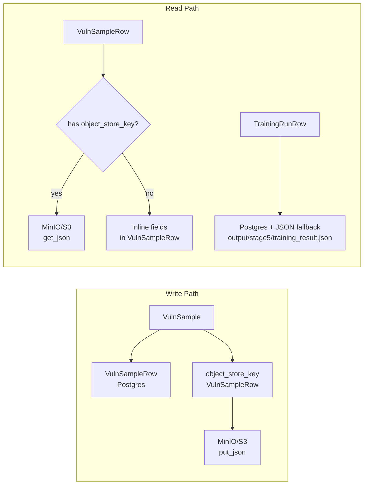

### Schema layer — `app/schemas/`

All data flows through Pydantic models defined in the `app/schemas/` package:

```
app/schemas/
├── vuln.py                     # VulnSample, StaticFinding
├── dataset.py                  # InstructionExample (Stage 3 training data)
├── prediction_eval.py          # ModelPrediction, Tier1Result, Tier2Result,
│                               #   ExecEvalResult, LlmJudgeScore,
│                               #   EvalMetrics, EvalReport,
│                               #   GeneralCapabilityResult/Metrics,
│                               #   RegressionReport/Summary
├── training.py                 # TrainingRun, TrainingResult, SweepResult
├── quantization.py             # QuantMethod, QuantStatus, QuantResult, QuantReport
├── serving.py                  # ServeRequest/Response, BatchServeRequest/Response, ServeManifest
├── ci.py                       # GateStatus, GateCheck, RegressionGateResult,
│                               #   SecurityScanSummary, CiReport
├── documentation.py            # CWE_SCOPE, LANGUAGE_SCOPE, BASE_MODEL,
│                               #   EvalMetricsSnapshot, TrainingRunData,
│                               #   QuantResultData, ModelCardData,
│                               #   TrainingReportData, DemoResult
└── vuln_sample.py              # (if exists — see repo)
```

### CWE & language scope

The harness targets exactly six CWE classes, defined in `app/data/collectors/cwe_scope.py`
as `CweSpec` objects and re-exported alongside `LANGUAGE_SCOPE`, `BASE_MODEL`,
and `TRAINING_METHODS` in `app/schemas/documentation.py`:

| CWE | Name |
|---|---|
| CWE-89 | SQL Injection |
| CWE-79 | Cross-site Scripting (XSS) |
| CWE-22 | Path Traversal |
| CWE-78 | OS Command Injection |
| CWE-190 | Integer Overflow |
| CWE-502 | Deserialization of Untrusted Data |

---

## The 11-Stage Pipeline

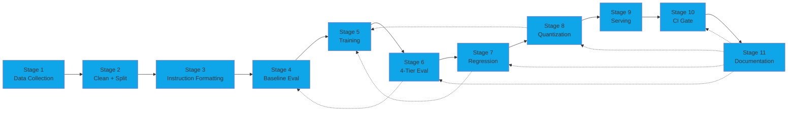

### Stage 1: Data Collection

**Module:** `app/data/collectors/`
**Entry:** `app/data/collectors/cli.py` → `run_pipeline()` in `pipeline.py`

Stage 1 ingests vulnerability data from three sources, normalizes them into
`VulnSample` records, and persists them to storage.

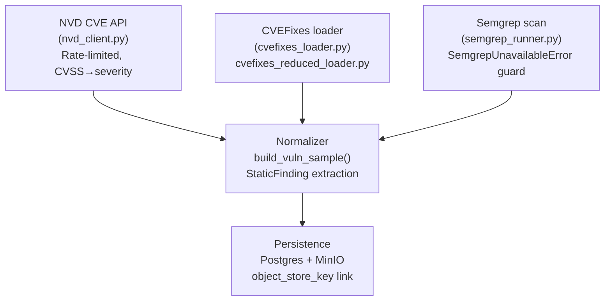

**Key functions:**

| Function | File | Purpose |
|---|---|---|
| `run_pipeline()` | `pipeline.py` | Main orchestrator — fetches, normalizes, persists |
| `build_vuln_sample()` | `pipeline.py` | Converts raw CVE/CVEFixes/Semgrep data into `VulnSample` |
| `CweSpec` / `cwe_scope.py` | `cwe_scope.py` | Defines the 6 in-scope CWE classes |
| `NvdClient` | `nvd_client.py` | NVD API client with rate-limiting and CVSS → severity mapping |
| `run_semgrep()` | `semgrep_runner.py` | Runs Semgrep static analysis; raises `SemgrepUnavailableError` |
| `CveFixesLoader` | `cvefixes_loader.py` | Loads CVE/CWE data from the CVEFixes dataset |

**Output:** `VulnSample` records persisted to Postgres (`vuln_samples` table) with an
`object_store_key` that links to the JSON payload in MinIO.

---

### Stage 2: Cleaning, Dedup & Leakage-Safe Split

**Module:** `app/data/cleaning/`
**Entry:** `app/data/cleaning/cli.py` → `run_stage2()` in `pipeline.py`

Stage 2 transforms raw samples into leakage-safe train/val/test splits. The
critical invariant: samples from the same repository are grouped together so
they never span split boundaries.

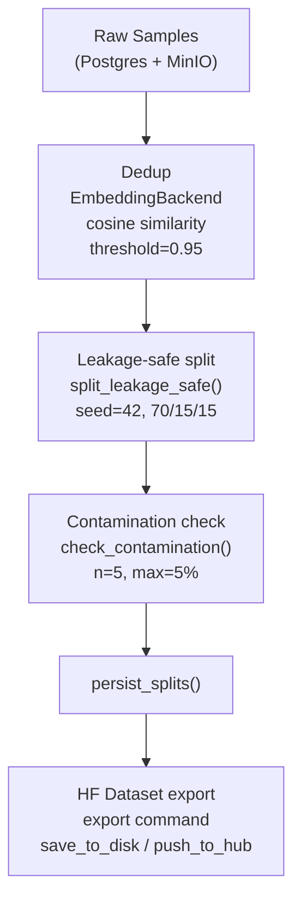

**Key functions:**

| Function | File | Detail |
|---|---|---|
| `run_stage2()` | `pipeline.py` | Orchestrator: load → dedup → split → check → persist |
| `load_samples_from_storage()` | `pipeline.py` | Reads from Postgres (`VulnSampleRow`) + MinIO (`get_json`); prefers Postgres `split` value |
| `EmbeddingBackend` | `cleaning/pipeline.py` | Protocol for dedup similarity (lazy-imports `sentence-transformers`) |
| `split_leakage_safe()` | `pipeline.py` | Groups by `repo_name`; seed=42; 70/15/15 ratio |
| `check_contamination()` | `pipeline.py` | Validates no cross-split contamination (n=5 samples, max 5% threshold) |
| `persist_splits()` | `pipeline.py` | Clears all splits, re-sets them (idempotent) |
| `Stage2Result` | `pipeline.py` | Dataclass returning counts: `n_raw`, `n_deduped`, `n_train`, `n_val`, `n_test` |
| `HF_COLUMNS` | `hf_dataset.py` | 12-field column mapping for HuggingFace `datasets` |
| `save_dataset_locally()` | `hf_dataset.py` | `dataset.save_to_disk()` for local HF-format export |
| `push_to_hub()` | `hf_dataset.py` | Pushes to HuggingFace Hub (requires `HF_TOKEN`) |

**CLI commands:**

```python
# app/data/cleaning/cli.py
app = typer.Typer()
# `clean`         — full pipeline (dedup + split + persist)
# `plan`          — leakage-aware plan, shows repo × CWE × split counts
# `export`        — export to HF Hub or local disk
# `check-contamination` — train vs gold-eval contamination check
```

---

### Stage 3: Instruction Formatting

**Module:** `app/data/formatting/`
**Entry:** `app/data/formatting/cli.py` → `run_stage3()` in `pipeline.py`

Stage 3 converts cleaned samples into instruction-following training examples
with a strict JSON schema and a hard token budget.

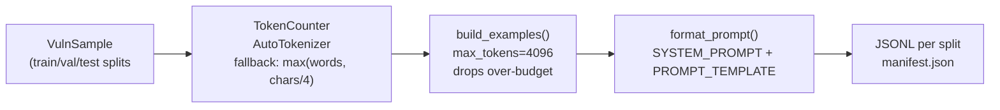

#### The instruction schema

The system prompt (`SYSTEM_PROMPT` in `template.py`) instructs the model to
perform four tasks: (1) identify the CWE, (2) assess severity, (3) explain the
vulnerability, and (4) output a unified diff patch.

```python
# app/data/formatting/template.py — key constants

SYSTEM_PROMPT = """You are a security-focused code assistant. ..."""

PROMPT_TEMPLATE = """{system_prompt}

### Task
...
### Response Format (JSON)
{{
    "cwe_id": "...",
    "severity": "...",
    "explanation": "...",
    "patch_diff": "..."
}}"""
```

| Component | File:Line | Detail |
|---|---|---|
| `SYSTEM_PROMPT` | `template.py` | 4-task security instruction (CWE, severity, explanation, patch) |
| `PROMPT_TEMPLATE` | `template.py` | Alpaca/OpenAI-style; placeholders: `{language}`, `{vulnerable_code}`, `{static_findings}` |
| `PromptRenderer` | `template.py` | Protocol for template rendering |
| `format_static_findings()` | `template.py` | Renders `StaticFinding` list into markdown |
| `make_patch_diff()` | `template.py` | Uses `difflib.unified_diff` — no git dependency |
| `format_prompt()` | `template.py` | Full prompt = system + template + sample rendering |
| `TokenCounter` | `tokenizer.py` | Protocol class; lazy-loads `AutoTokenizer`; falls back to `_heuristic_count()` |
| `DEFAULT_MODEL` | `tokenizer.py` | `"Qwen/Qwen2.5-Coder-7B-Instruct"` |
| `DEFAULT_MAX_TOKENS` | `tokenizer.py` | `4096` |
| `count_prompt_and_target()` | `tokenizer.py` | Counts prompt + all non-None target fields |
| `build_instruction_example()` | `builder.py` | Builds `InstructionExample`; returns `None` if over budget |
| `build_examples()` | `builder.py` | Returns `BuildResult(examples, dropped)` where `dropped` = list of (sample_id, token_count) |
| `run_stage3()` | `pipeline.py` | Orchestrator: load → filter by split → `build_examples()` → write JSONL per split |
| `OUTPUT_SPLITS` | `pipeline.py` | `("train", "val", "test")` |

#### Stage 3 output

Each split produces:

```
output/stage3/
├── train.jsonl
├── val.jsonl
├── test.jsonl
└── manifest.json
```

Each `InstructionExample` record:

| Field | Type | Description |
|---|---|---|
| `id` | str | `ie_...` prefix |
| `sample_id` | str | Source `VulnSample` ID |
| `prompt` | str | Full rendered prompt (system + user message) |
| `target_cwe` | str | Target CWE class |
| `target_severity` | str | Target severity level |
| `target_explanation` | str | Target explanation text |
| `target_patch_diff` | str | Target unified diff |
| `token_count_estimate` | int | Estimated token count (prompt + targets) |

---

### Stage 4: Baseline Evaluation

**Module:** `app/evaluation/`
**Entry:** `run_baseline()` in `baseline.py`

Stage 4 evaluates the un-fine-tuned base model (`Qwen2.5-Coder-7B-Instruct`)
on the gold-eval set using zero-shot or few-shot prompting, producing
baseline metrics for the Stage 10 gate to compare against.

> **Dual-model design:** The *designed-for* model is the 7B variant
> (`Qwen/Qwen2.5-Coder-7B-Instruct`), set as `DEFAULT_BASE_MODEL` in
> `app/evaluation/backends.py`, `app/training/config.py`, and
> `app/quantization/config.py`. The **CLI scripts** in `scripts/` and
> `app/evaluation/cli.py` instead default to the 1.5B variant
> (`Qwen/Qwen2.5-Coder-1.5B-Instruct`) — defined as
> `DEFAULT_BASE_MODEL` in `cli.py` and `DEFAULT_FAST_MODEL` in the config
> modules — for faster iteration on CPU. The CLI exposes the 7B model as
> `--base-model` override (and `DEFAULT_BASE_MODEL_7B` for the explicit
> few-shot path). The 7B model is the production/baseline target that the
> CI gate compares fine-tuned checkpoints against.

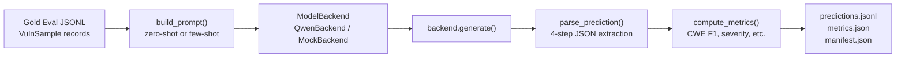

#### The 4-step parser

`parse_prediction()` in `parser.py` handles real-world LLM output noise:

1. **Strip leading standalone backticks** — removes empty ` ``` ` blocks the model
   echoes from the prompt template, without consuming ` ```json ` fences.
2. **Extract ```` ```json ```` blocks** — finds all fenced JSON blocks, skipping
   template placeholders (`"cwe_id": "..."`).
3. **Brace-matched JSON extraction** — `_find_json_objects()` iterates every `{`
   position to handle multiple JSON objects (template + real data).
4. **Regex fallback** — `_try_fallback_extract()` rescues fields from malformed
   JSON (e.g., unescaped quotes in `patch_diff` from source code).

```python
# app/evaluation/parser.py — key patterns

_JSON_FENCE_RE = re.compile(r"```(?:json)?\n([\s\S]*?)```", re.IGNORECASE)
_CWE_RE = re.compile(r"\bCWE-(\d{2,4})\b", re.IGNORECASE)
_VALID_SEVERITIES = {"low", "medium", "high", "critical"}
```

#### Metrics

| Metric | Function | Detail |
|---|---|---|
| CWE Macro-F1 | `compute_cwe_macro_f1()` | Per-class precision/recall/F1; macro = mean (penalizes empty classes) |
| CWE Micro-accuracy | `compute_cwe_micro_accuracy()` | Exact-match rate across all samples |
| Severity accuracy | `compute_severity_accuracy()` | Correct severity classification |
| Hallucination rate | `compute_hallucination_rate()` | Predicted CWE not in the 6-class scope |
| Patch coverage | `compute_patch_coverage()` | Lines patched / total vuln lines (per sample) |
| Per-class stats | `BaselineMetrics.per_class` | Precision/recall/F1 per CWE |

`_VALID_CWE_IDS` is a `frozenset` of the 6 in-scope classes, used to detect
hallucinations.

#### Backends

| Backend | File | Detail |
|---|---|---|
| `QwenBackend` | `backends.py` | Real transformers backend; lazy-loads torch + model; **`MissingAdapterWeightsError` guard** prevents silent base-model fallback when a LoRA adapter is specified but its weights are missing |
| `MockBackend` | `backends.py` | Returns canned JSON responses keyed by prompt substring |

---

### Stage 5: Training

**Module:** `app/training/`
**Entry:** `run_sft()` / `run_dpo()` in `trainer_*.py`

Stage 5 fine-tunes the base model on Stage 3 instruction examples. Two
training methods are supported, plus LoRA-rank sweeps.

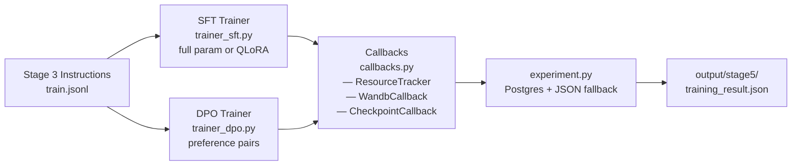

#### Training configs

| Config | File | Detail |
|---|---|---|
| `SFTConfig` | `config.py` | Full-parameter or QLoRA (4-bit NF4) supervised fine-tuning |
| `DPOConfig` | `config.py` | Direct preference optimization from preference pairs |
| `SweepConfig` | `config.py` | LoRA-rank sweep (ranks 8–128) |

#### Key functions

| Function | File | Detail |
|---|---|---|
| `run_sft()` | `trainer_sft.py` | Full SFT orchestrator with `--dry-run` support |
| `run_dpo()` | `trainer_dpo.py` | DPO with `build_preference_pairs()`; `_dpo_load_model()` has an FSDP compat shim; uses `bf16=False` |
| `estimate_training_steps()` | `trainer_sft.py` | Calculates steps from dataset size, batch size, epochs |
| `_check_can_train()` | `trainer_sft.py` | Pre-flight GPU/VRAM check |
| `persist_training_run()` | `experiment.py` | Writes to Postgres `training_runs` table; falls back to `output/stage5/training_result.json` |
| `load_training_run()` | `experiment.py` | Reads from Postgres or JSON fallback by run ID |
| `list_training_runs()` | `experiment.py` | Lists runs, optionally filtered by method/status |
| `generate_run_id()` | `experiment.py` | Format: `{method}_{run_name?}_{timestamp}_{short_uuid}` |

#### Training callbacks

| Callback | File | Detail |
|---|---|---|
| `ResourceTracker` | `callbacks.py` | Tracks peak VRAM (`torch.cuda.max_memory_allocated`) and elapsed wall-clock |
| `WandbCallback` | `callbacks.py` | Lazy-imports `wandb`; supports mock mode for CI |
| `CheckpointCallback` | `callbacks.py` | Uploads checkpoints to MinIO via `get_client()`; walks checkpoint dir |
| `ProgressCallback` | `callbacks.py` | Typer/CLI progress reporting |
| `TrainingCallback` | `callbacks.py` | Protocol: `on_init`, `on_step`, `on_epoch`, `on_train_end`, `on_error` |

---

### Stage 6: Four-Tier Evaluation

**Module:** `app/evaluation/`
**Entry:** `EvaluationRunner.run()` in `runner.py`

Stage 6 evaluates the fine-tuned model through a four-tier escalation: cheap
deterministic checks first, expensive LLM judges last. This avoids wasting
inference budget on cases a regex can solve.

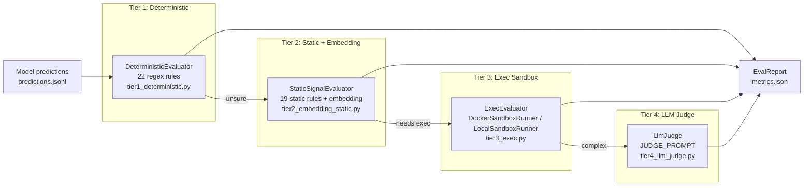

#### Tier 1 — Deterministic Rules

`DEFAULT_TIER1_RULES` defines 22 regex-based rules across the 6 CWEs.
`PatternRule` matches simple, well-known anti-patterns (e.g., `os.system(user_input)`
for command injection). `DeterministicEvaluator` applies these rules first —
if a rule fires, the prediction is accepted without further escalation.

#### Tier 2 — Static Signal + Embedding

`DEFAULT_RULE_TO_CWE` defines 19 mappings from static signal patterns to CWE
classes. When a deterministic rule misses but a static signal matches
(e.g., a function call pattern associated with a CWE), the evaluator uses
dense embedding cosine similarity (`_cosine_similarity`) to find the closest
known vulnerability pattern.

#### Tier 3 — Executable Sandbox

The most expensive tier: proposed patches are **actually executed** to verify
they fix the vulnerability.

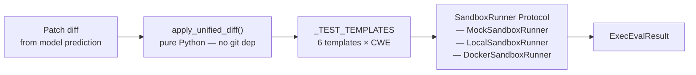

| Sandbox | Detail |
|---|---|
| `MockSandboxRunner` | Returns canned results; no execution |
| `LocalSandboxRunner` | Runs `subprocess` in a temp directory; uses `difflib` to apply patches |
| `DockerSandboxRunner` | Uses `vuln-triage-sandbox:python3.11` image with: read-only filesystem, no network, non-root user (UID 1000), memory limit 512 MB |

`apply_unified_diff()` is a pure-Python implementation (no git dependency).
`_TEST_TEMPLATES` contains 6 test templates — one per CWE class — that
generate synthetic test cases for verification.

`check_hallucinated_function_ref()` detects when a patch references a function
that doesn't exist in the original code (a common hallucination pattern).

#### Tier 4 — LLM Judge

`JUDGE_PROMPT` in `tier4_llm_judge.py` asks the model to score two dimensions:

- **Explanation quality** (0–1): Does the explanation correctly identify the
  vulnerability mechanism?
- **Patch minimality** (0–1): Is the patch minimal and sufficient?

| Backend | Detail |
|---|---|
| `MockLlmJudgeBackend` | Canned 0.5/0.5 defaults |
| `LocalLlmJudgeBackend` | HF model, `torch.no_grad()`, `float16` |
| `LlmJudge` | Uses `OPENAI_API_KEY` / `OPENAI_BASE_URL` for API-based judging |

`_parse_judge_response()` uses 3-tier extraction: strict `json.loads` →
brace-matching (`_find_json_objects`) → regex extraction; clamps to [0, 1].

#### Evaluation metrics

`EvalMetrics` (in `schemas/prediction_eval.py`) captures:

| Field | Source |
|---|---|
| `model_cwe_macro_f1` | Model F1 across all samples |
| `tier1_cwe_macro_f1` | Tier 1 deterministic F1 |
| `tier2_cwe_macro_f1` | Tier 2 static + embedding F1 |
| `tier1_coverage` | Fraction of samples Tier 1 resolved |
| `tier2_coverage` | Fraction of samples Tier 2 resolved |
| `exec_pass_rate` | Tier 3: fraction of patches that pass tests |
| `patch_applies_rate` | Tier 3: patches successfully apply (no diff errors) |
| `build_succeeds_rate` | Tier 3: code compiles after patch |
| `hallucination_rate` | Tier 3: fraction with `hallucinated_cwe=True` (made-up CWE IDs) |
| `avg_patch_coverage` | Mean fraction of vuln lines patched |
| `avg_explanation_quality` | Tier 4 LLM judge score (0–1) |
| `avg_patch_minimality` | Tier 4 LLM judge score (0–1) |
| `per_class` | Per-CWE precision/recall/F1 breakdown |

`EvaluationRunner.compute_metrics()` aggregates per-tier results and returns
an `EvalReport` containing: `metrics`, `manifest` (with `run_id`, `config`,
`tier_order`).

```python
# app/evaluation/runner.py — EvalConfig
@dataclass
class EvalConfig:
    base_model: str
    embedding_model: str | None = None
    sandbox_mode: str = "mock"  # "mock" | "local" | "docker"
    llm_judge_model: str | None = None
    max_concurrent: int = 4
    skip_tier4: bool = False
    skip_tier3: bool = False
```

---

### Stage 7: Regression & Forgetting

**Module:** `app/evaluation/general_capability.py`

Stage 7 checks whether fine-tuning eroded the model's general coding ability
(forgetting). It runs 12 standard algorithm tasks against both the base and
tuned models, then computes a delta.

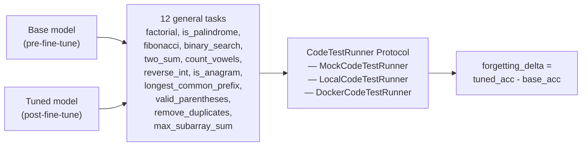

| Task | Description |
|---|---|
| `factorial` | Compute factorial iteratively |
| `is_palindrome` | Check string reversal |
| `fibonacci` | Nth Fibonacci number |
| `binary_search` | Search sorted array |
| `two_sum` | Find pair summing to target |
| `count_vowels` | Count vowels in string |
| `reverse_int` | Reverse integer digits |
| `is_anagram` | Check anagram |
| `longest_common_prefix` | Find LCP of string list |
| `valid_parentheses` | Check balanced brackets |
| `remove_duplicates` | Dedup sorted list |
| `max_subarray_sum` | Kadane's algorithm |

All 12 tasks use **Python stdlib only** — no external dependencies.

| Runner | Detail |
|---|---|
| `MockCodeTestRunner` | Canned pass/fail results |
| `LocalCodeTestRunner` | Runs `subprocess` with pytest in a temp directory |
| `DockerCodeTestRunner` | Uses `vuln-triage-sandbox:python3.11` (same image as Stage 6 Tier 3) with read-only FS, no network, 512 MB RAM, UID 1000 |

Key functions:

| Function | Detail |
|---|---|
| `run_regression_analysis()` | Runs tasks on base + tuned, computes `delta = tuned_acc - base_acc` |
| `estimate_cost_per_accepted_patch_usd()` | Estimates cost based on inference token counts |
| `build_regression_summary()` | Combines Stage 6 `EvalMetrics` + Stage 7 delta into a `RegressionSummary` (CI gate input) |
| `_extract_code()` | Pulls code from LLM output (handles fences, language tags) |
| `_sanitize_paths()` | Redacts machine-specific paths from test output |

---

### Stage 8: Quantization Matrix

**Module:** `app/quantization/`
**Entry:** `run_quantization_matrix()` in `quantizer.py`

Stage 8 quantizes the fine-tuned model across multiple methods and bit-widths,
then scores each configuration to recommend the best tradeoff.

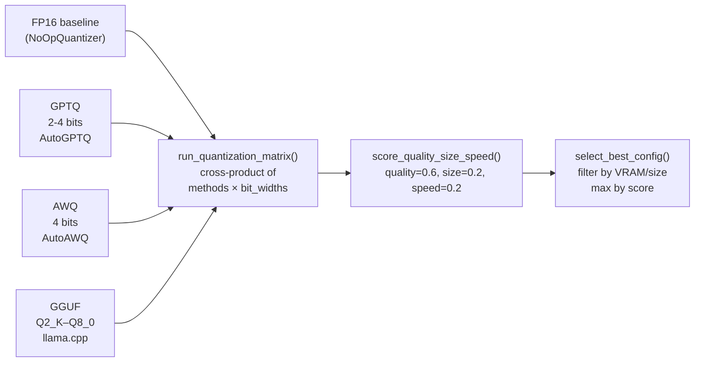

#### Scoring function

`score_quality_size_speed()` in `quantizer.py`:

| Weight | Dimension | Normalization |
|---|---|---|
| 0.6 | Quality (CWE Macro-F1) | Relative to FP16 baseline |
| 0.2 | Size | Normalized against 14 GB (7B model FP16) |
| 0.2 | Speed (tokens/sec) | Normalized against 30 t/s GPU baseline |

#### Quantizer implementations

| Backend | File | Detail |
|---|---|---|
| `_NoOpQuantizer` | `quantizer.py` | Returns FP16 baseline (no quantization) |
| `GPTQQuantizer` | `export_gptq.py` | GPU-based; 2–4 bits; no calibration dataset; lazy-imports `auto_gptq` |
| `AWQQuantizer` | `export_awq.py` | Weight-only AWQ; 4-bit; lazy-imports `autoawq` (`awq.AutoAWQForCausalLM`); `q_order="tloss"` |
| `GGUFQuantizer` | `export_gguf.py` | Two modes: Python `gguf.LlamaQuantize` (llama.cpp bindings) or `llama-quantize` CLI. `convert_hf_to_gguf_f16()` converts HF/PEFT checkpoints to F16 GGUF using `gguf.GGUFWriter` with Qwen2 tensor-name mapping (`_HF_TENSOR_MAP`). GGUF types Q2_K, Q3_K, Q4_0, Q4_K, Q5_K, Q8_0, F16, F32 |
| `MockQuantizer` | `quantizer.py` | Heuristic estimates via `estimate_*` functions |

`gguf_type_to_bits()` maps GGUF quant-type strings to bit-width integers (Q2_K→2, Q4_K→4, F16→16, etc.).

`_try_quantize()` wraps each quantization attempt; failures are captured as
`QuantStatus.FAILED` rather than crashing the entire matrix.

#### Config

`QuantConfig` (in `config.py`):

| Field | Default | Detail |
|---|---|---|
| `base_model` | `DEFAULT_BASE_MODEL` | Qwen2.5-Coder-7B-Instruct |
| `source_checkpoint` | — | HF model ID or local checkpoint path |
| `output_base` | `./output/stage8` | Output directory |
| `methods` | `[]` | List of `QuantMethod` enums to try |
| `bit_widths` | `[2,3,4,8]` | Target bit widths |
| `gptq_config` | `GPTQConfig` | `bits=4`, `group_size=128`, `desc_act=2`, `damping=0.06` |
| `awq_config` | `AWQConfig` | `bits=4`, `group_size=128`, `zero_point=True`; `q_order="tloss"` hardcoded in `AWQQuantizer.quantize()` |
| `gguf_config` | `GGUFConfig` | `quant_types=DEFAULT_GGUF_QUANT_TYPES` ([Q2_K, Q3_K, Q4_0, Q4_K, Q5_K, Q8_0]); `f16_fallback=False` |
| `dry_run` | `False` | Heuristic estimates only, no quantization |
| `mock` | `False` | Use `MockQuantizer` (deterministic, no ML deps) |
| `target_vram_gb` | `None` | Filter configs exceeding VRAM budget |
| `target_size_gb` | `None` | Filter configs exceeding size budget |

Heuristics (`_QUALITY_BY_BITS`, `_VRAM_BY_BITS`, `_SIZE_BY_BITS`) are tuned for
7B models. `estimate_quality()` returns quality relative to FP16; `estimate_vram_gb()`
and `estimate_model_size_gb()` provide per-method estimates.

---

### Stage 9: Air-Gapped Serving

**Module:** `app/serving/`
**Entry:** `app/serving/cli.py` — Typer command registered on shared `app`

Stage 9 serves the quantized model behind a FastAPI HTTP API and a CLI,
designed to run **air-gapped** (no external API calls, localhost-bite-only
by default).

```mermaid
flowchart LR
    subgraph "API Mode"
        FastAPI["FastAPI app<br/>create_app()"]
        Health["GET /healthz"]
        Manifest["GET /api/v1/manifest"]
        Serve["POST /api/v1/serve<br/>→ serve_sample()"]
        Batch["POST /api/v1/serve/batch<br/>→ serve_batch()"]
    end
    subgraph "CLI Mode"
        CLI["`serve` Typer command"]
        Analyze["--analyze<br/>single JSON file → stdout"]
        BatchCLI["--batch<br/>JSON array → stdout"]
        DryRun["--dry-run<br/>print config + warnings"]
    end
    subgraph "Backend Dispatch"
        LlamaCpp["LlamaCppBackend<br/>llama-cpp-python (default)"]
        LlamaSrv["LlamaServerBackend<br/>llama-server subprocess"]
        Transformers["TransformersBackend<br/>HF format dir, float16"]
        Ollama["OllamaBackend<br/>localhost:11434"]
        Mock["MockServingBackend<br/>canned responses"]
    end

    FastAPI --> Health
    FastAPI --> Manifest
    FastAPI --> Serve
    FastAPI --> Batch
    CLI --> Analyze
    CLI --> BatchCLI
    CLI --> DryRun
    Serve --> LlamaCpp
    Serve --> LlamaSrv
    Serve --> Transformers
    Serve --> Ollama
    Serve --> Mock
```

#### The orchestrator — `VulnerabilityServer`

`app/serving/serve.py` contains the single orchestrator that ties the serving
backend to the Stage 4 prompt and parser pipeline:

```
VulnSample → build_zero_shot_prompt() → backend.generate() → parse_prediction() → ServeResponse
```

| Method | Detail |
|---|---|
| `serve_sample(ServeRequest)` | Single-sample: builds `VulnSample`, renders zero-shot prompt, calls backend, parses prediction |
| `serve_batch(BatchServeRequest)` | Concurrent batch serving via `asyncio.gather` |
| `from_config(ServingConfig)` | Factory: `backend_type` dispatches to `LlamaCppBackend`, `LlamaServerBackend`, `TransformersBackend`, `OllamaBackend`, or `MockServingBackend` |
| `_normalize_severity()` | Fallback severity normalization for non-standard values |

#### Serving backends

| Backend | Detail |
|---|---|
| `LlamaCppBackend` | Default air-gapped CPU backend; lazy-loads `llama_cpp` in `_load()`; handles dict/str output formats |
| `LlamaServerBackend` | Spawns `llama-server` as subprocess; health-probe polls up to 60 s; POST `/completion`; `_find_llama_server()` checks `tools/llama-cpp/` then `PATH` |
| `TransformersBackend` | HF-format directory; `torch.float16`, `device_map="auto"` |
| `OllamaBackend` | `localhost:11434`, POST `/api/chat`; lazy-imports `httpx` |
| `MockServingBackend` | `responses` dict keyed by prompt substring; for CI/testing |

All heavy imports (`llama_cpp`, `transformers`, `torch`, `httpx`) are lazy.

#### Config

`ServingConfig` (in `config.py`):

| Field | Default | Detail |
|---|---|---|
| `model_path` | `""` | GGUF checkpoint path or model name |
| `backend_type` | `"llama.cpp"` | One of `_VALID_BACKEND_TYPES` |
| `num_ctx` | 4096 | Context window |
| `num_threads` | 4 | CPU threads (llama.cpp only) |
| `n_gpu_layers` | 0 | GPU layers (llama.cpp only) |
| `f16_kv` | `True` | F16 key-value cache |
| `temperature` | 0.2 | Sampling temperature |
| `max_new_tokens` | 2048 | Max generation tokens |
| `host` | `"0.0.0.0"` | Bind address |
| `port` | 8000 | Bind port |
| `request_timeout` | 30.0 | HTTP timeout (Ollama) |

`run_name` property combines backend + model for logging. `all_warnings()`
validates config and returns a list of warning strings. `is_mock()` returns
`True` when `backend_type == "mock"`.

#### CLI modes

```python
# app/serving/cli.py — `serve` command options
serve(
    --model-path / -m       # GGUF checkpoint or model name
    --backend / -b          # 'llama.cpp' | 'llama-server' | 'ollama' | 'mock'
    --num-ctx               # 4096
    --num-threads           # 4 (CPU)
    --n-gpu-layers          # 0
    --temperature           # 0.2
    --max-new-tokens        # 2048
    --request-timeout       # 30.0
    --host / -h             # 0.0.0.0
    --port / -p             # 8000
    --analyze / -a          # Single-file mode (no server)
    --batch                 # Batch mode (no server)
    --input-file / -i       # JSON input for analyze/batch
    --output-file / -o      # Optional JSON output
    --dry-run               # Print config and exit
)
```

---

### Stage 10: CI Regression Gate

**Module:** `app/ci/`
**Entry:** `run_gate()` in `gate.py`

Stage 10 is the CI/CD decision engine. It loads artifacts from Stages 4, 6,
and 7, then evaluates four threshold checks to decide whether a checkpoint is
promotable.

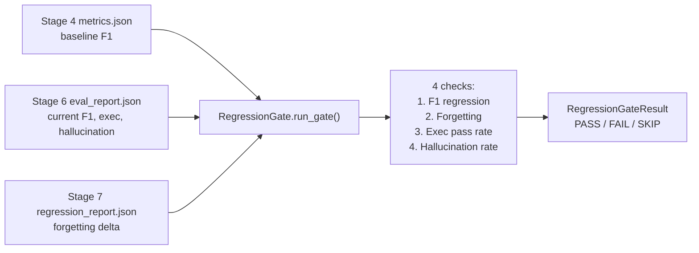

#### The four checks

| Check | Threshold field | Default | Logic |
|---|---|---|---|
| CWE F1 regression | `max_f1_drop_percent` | 5.0% | `drop = (baseline_F1 - current_F1) / baseline_F1 × 100`; fails if `drop > allowed` |
| Forgetting | `forgetting_threshold` | -0.10 | `delta = tuned_acc - base_acc`; PASS if `delta ≥ threshold` (skip if Stage 7 absent) |
| Exec pass rate | `min_exec_pass_rate` | 0.0 | `exec_pass_rate ≥ min` (0.0 = no hard floor; non-zero recommended for real CI) |
| Hallucination rate | `max_hallucination_rate` | 0.50 | `hall_rate ≤ max` |

**Overall status:** FAIL if any check fails; PASS otherwise (skipped checks
don't affect the outcome).

- `FileNotFoundError` is raised for missing Stage 4/6 reports.
- Stage 7 report is optional — the forgetting check is `SKIP`ped when absent.
- Path validation uses `validate_path()` (path-traversal prevention, CWE-22).
- Log injection sanitized via `_sanitize_for_log()` (CRLF strip, CWE-117).

#### Security scanning integration

`app/ci/security_scanners.py` parses JSON output from two security scanners:

| Parser | Tool | Function | Detail |
|---|---|---|---|
| `parse_gitleaks_output()` | Gitleaks (`gitleaks detect`) | Secret scanning | Returns `SecurityScanSummary` with severity counts; caps stored details at 50 findings |
| `parse_trivy_output()` | Trivy (`trivy fs .`) | Vulnerability + misconfiguration scanning | Flattens `Vulnerabilities`, `Misconfigurations`, `Secrets`, `Licenses` lists across all targets |

Both parsers are intentionally defensive — they tolerate truncated/empty input
and always return a valid `SecurityScanSummary`. The `_resolve_raw()` helper
accepts a JSON string, a file path, a `Path` object, or `None`, with path
validation to prevent CWE-22 filesystem escape.

---

### Stage 11: Documentation & Demo

**Module:** `app/stage11/`
**Entry:** `run_stage11()` → `Stage11Generator` class

Stage 11 assembles the final deliverables — a model card, training report, and
a runnable demo script — from artifacts produced by earlier stages. It works
**without** a GPU, without a model download, and without network access (mock
mode), so CI validates the deliverables on every push.

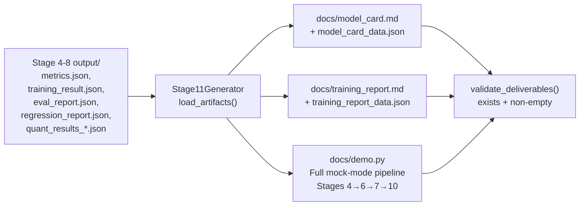

#### Deliverables

| File | Purpose |
|---|---|
| `docs/model_card.md` | Human-readable model card (YAML front matter + sections: Details, Intended Use, Evaluation, Quantization Options, Serving, Limitations, Ethical Considerations, Out of Scope, Citation) |
| `docs/training_report.md` | Technical report (Overview, Training Runs, Evaluation Results, Quantization Matrix, Regression Gate, Conclusions, Recommendations) |
| `docs/demo.py` | Self-contained demo script running Stages 4→6→7→10 in mock mode |
| `output/stage11/model_card_data.json` | Machine-readable model card (CI archival) |
| `output/stage11/training_report_data.json` | Machine-readable training report (CI archival) |

#### `Stage11Config`

| Field | Default | Detail |
|---|---|---|
| `base_model` | `BASE_MODEL` (Qwen2.5-Coder-7B-Instruct) | Fine-tuned base model |
| `model_name` | `DEFAULT_MODEL_NAME` (≈ `vuln-triage-qwen2.5-coder-1.5b`) | Derived via `_derive_model_name(DEFAULT_FAST_MODEL)` |
| `training_method` | `sft_qlora` | `sft_qlora`, `sft_full`, or `dpo` |
| `lora_rank` | 64 | LoRA rank (None for full SFT) |
| `quant_method` | `None` | e.g., `"gguf"` |
| `quant_bit_width` | `None` | e.g., 4 |
| `cwe_scope` | `CWE_SCOPE` (6 classes) | In-scope CWEs |
| `language` | `"python"` | Primary language |
| `training_data_size` | 5000 | Post-cleaning sample count |
| `execution_environment` | `"mock"` | `mock`, `cpu`, or `cuda` |
| `output_dir` | `./output/stage11` | Output directory |
| `docs_dir` | `docs` | Documentation directory |

#### `run_demo()` — the full mock pipeline

The `Stage11Generator.run_demo()` method orchestrates a complete 4-stage mock
run on the gold-eval set:

1. **Stage 4** — `MockBackend` with canned CWE-89 responses → `predictions.jsonl`
2. **Stage 6** — `EvaluationRunner` with `sandbox_mode="mock"`, `skip_tier4=True`
3. **Stage 7** — `LocalCodeTestRunner` with mock backends for both base + tuned
4. **Stage 10** — `RegressionGate` reading the generated artifacts

---

## Injectable Backend Pattern

Every stage that interacts with the outside world (model inference, embeddings,
tokenization, code execution, quantization, LLM judging, serving) does so
through a `Protocol`-defined interface with at least one mock implementation.
This enables full CI validation without GPU, network, or model downloads.

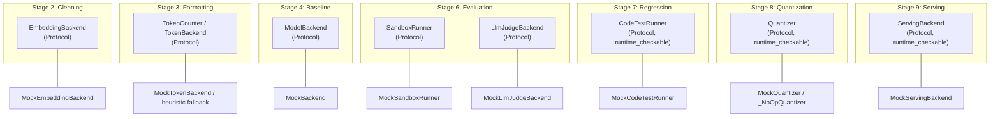

### Injection matrix

| Backend Protocol | File | Real implementations | Mock implementation |
|---|---|---|---|
| `ModelBackend` | `evaluation/backends.py` | `QwenBackend` (transformers) | `MockBackend` |
| `EmbeddingBackend` (dedup) | `data/cleaning/pipeline.py` | Protocol | `MockEmbeddingBackend` (Stage 2) |
| `EmbeddingBackend` (Tier 2) | `evaluation/tier2_embedding_static.py` | Concrete class (lazy `sentence-transformers`); `StaticSignalEvaluator` injects it | None (static-only when `embedding_model=None`) |
| `TokenBackend` | `data/formatting/tokenizer.py` | `HFTokenBackend` | `MockTokenBackend` (heuristic fallback) |
| `CodeTestRunner` | `evaluation/general_capability.py` | `LocalCodeTestRunner`, `DockerCodeTestRunner` | `MockCodeTestRunner` |
| `SandboxRunner` | `evaluation/tier3_exec.py` | `LocalSandboxRunner`, `DockerSandboxRunner` | `MockSandboxRunner` |
| `LlmJudgeBackend` | `evaluation/tier4_llm_judge.py` | `LocalLlmJudgeBackend`, `LlmJudge` (OpenAI) | `MockLlmJudgeBackend` |
| `Quantizer` | `quantization/quantizer.py` | `GPTQQuantizer`, `AWQQuantizer`, `GGUFQuantizer` | `MockQuantizer`, `_NoOpQuantizer` |
| `ServingBackend` | `serving/backends.py` | `LlamaCppBackend`, `LlamaServerBackend`, `TransformersBackend`, `OllamaBackend` | `MockServingBackend` |
| `TrainingCallback` | `training/callbacks.py` | `ResourceTracker`, `WandbCallback`, `CheckpointCallback`, `ProgressCallback` | — (Protocol, no mock needed) |

---

## Security

The harness implements defence-in-depth across three layers:

### 1. Path traversal prevention — `app/security/paths.py`

```python
PathSecurityError(ValueError)
get_project_root()          # parents[2] — 3 levels above this module
get_allowed_bases(allow_temp)  # project root + (optionally) system temp
is_hf_model_id(path)      # heuristic: has '/', not absolute, not bare filename
validate_path(path, base_dir, *, allow_model_id, allow_temp)  # resolves + checks
validate_output_path(...)  # output-specific path validation
safe_read_text(path)      # validates before reading
```

- Relative paths resolve against the project root.
- HF model IDs (e.g., `Qwen/Qwen2.5-Coder-7B-Instruct`) are allowed via `allow_model_id=True`.
- Temp directories are allowed via `allow_temp=True`.
- Every file I/O helper across all stages calls `validate_path` before touching disk.

### 2. Log injection prevention — `app/ci/gate.py`

```python
def _sanitize_for_log(value: str) -> str:
    """Strip CR/LF — prevents CWE-117 log injection."""
    return str(value).replace("\r", "").replace("\n", "")
```

### 3. Execution sandbox — `app/evaluation/tier3_exec.py`

The Docker sandbox (`vuln-triage-sandbox:python3.11`) enforces:

| Constraint | Value |
|---|---|
| Filesystem | Read-only |
| Network | Disabled |
| User | Non-root (UID 1000) |
| Memory | 512 MB limit |
| Timeout | 300 s subprocess timeout |

### 4. Silent fallback guard — `app/evaluation/backends.py`

`QwenBackend` raises `MissingAdapterWeightsError` when a LoRA adapter is
specified but its weights file is missing. This prevents the silent fallback
to the base model, which would produce misleadingly poor results.

---

## CLI Reference

All commands are registered on a shared Typer app, with the serving CLI
(`app/serving/cli.py`) registered as a subcommand alongside the evaluation
commands (`app/evaluation/cli.py`).

```mermaid
flowchart BT
    Stage1["`stage1` / collectors.cli<br/>run_pipeline — ingest NVD/CVEFixes/Semgrep"]
    Stage2["`stage2` / cleaning.cli<br/>clean — dedup + split<br/>plan — leakage plan<br/>export — HF Hub/local<br/>check-contamination"]
    Stage3["`stage3` / formatting.cli<br/>build — format instructions<br/>stats — token stats<br/>inspect — sample prompt"]
    Stage4["`stage4` / evaluation.cli<br/>baseline — zero-shot/few-shot eval"]
    Stage5["`stage5` / training.cli<br/>sft / dpo — fine-tune"]
    Stage6["`stage6` / evaluation.cli<br/>stage6 — 4-tier evaluation"]
    Stage7["`stage7` / evaluation.cli<br/>stage7 — regression/forgetting"]
    Stage8["`stage8` / quantization.cli<br/>quantize — run matrix"]
    Stage9["`serve` / serving.cli<br/>serve — start uvicorn<br/>--analyze — single sample<br/>--batch — JSON array<br/>--dry-run — print config"]
    Stage10["`stage10` / ci.cli<br/>gate — run regression gate"]
    Stage11["`stage11` / stage11.cli<br/>docs — generate deliverables<br/>demo — run mock pipeline"]

    Stage1 --> Stage2 --> Stage3 --> Stage4 --> Stage5 --> Stage6 --> Stage7 --> Stage8 --> Stage9 --> Stage10 --> Stage11
```

---

## Output Directory Layout

```
output/
├── stage1/                    # Raw collected samples (Postgres + MinIO)
├── stage2/                    # Cleaned + split samples
│   └── splits/
│       ├── train.jsonl
│       ├── val.jsonl
│       └── test.jsonl
├── stage3/                    # Instruction-formatted examples
│   ├── train.jsonl
│   ├── val.jsonl
│   ├── test.jsonl
│   └── manifest.json
├── stage4/                    # Baseline evaluation artifacts
│   ├── predictions.jsonl
│   ├── parse_errors.jsonl
│   ├── metrics.json
│   └── manifest.json
├── stage5/                    # Training outputs
│   ├── training_result.json   # SFT result
│   └── dpo/
│       └── training_result.json  # DPO result
├── stage6/                    # Four-tier evaluation
│   └── eval_report.json
├── stage7/                    # Regression analysis
│   └── regression_report.json
├── stage8/                    # Quantization matrix
│   └── quant_results_*.json
├── stage9/                    # Serving checkpoints
│   └── (quantized GGUF models)
├── stage10/                   # CI gate result
│   └── gate_result.json
└── stage11/                   # Documentation artifacts
    ├── model_card_data.json
    ├── training_report_data.json
    └── demo/
        ├── stage4/
        ├── stage6/
        ├── stage7/
        └── stage10/
```

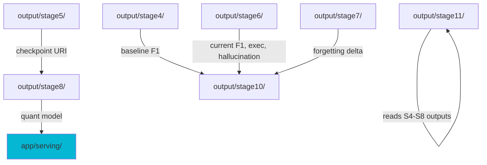

---

## Configuration

The project uses environment variables for infrastructure configuration with
sensible local-development defaults:

| Variable | Default | Used by |
|---|---|---|
| `DATABASE_URL` | `postgresql+psycopg2://localhost:5432/vuln_triage` | `app/storage/db.py` |
| `POSTGRES_USER` / `POSTGRES_PASSWORD` / `POSTGRES_DB` / `POSTGRES_HOST` / `POSTGRES_PORT` | local-dev fallback (`vuln_triage` / `local-dev-only-change-me`) | `app/storage/db.py` |
| `MINIO_ENDPOINT` | `http://localhost:9000` | `app/storage/object_store.py` |
| `MINIO_ACCESS_KEY` / `MINIO_SECRET_KEY` | `vuln_triage` / `vuln_triage_secret` | `app/storage/object_store.py` |
| `AWS_REGION` | `us-east-1` | `app/storage/object_store.py` |
| `DEFAULT_BUCKET` | `vuln-triage` (constant, not env var) | `app/storage/object_store.py` |
| `HF_TOKEN` | — | `app/data/cleaning/hf_dataset.py` (push_to_hub) |
| `OPENAI_API_KEY` | — | `app/evaluation/tier4_llm_judge.py` |
| `OPENAI_BASE_URL` | — | `app/evaluation/tier4_llm_judge.py` |

When Postgres/MinIO are unavailable, all persistence layers fall back to local
JSON files — no exception is raised for a missing database in CI.
