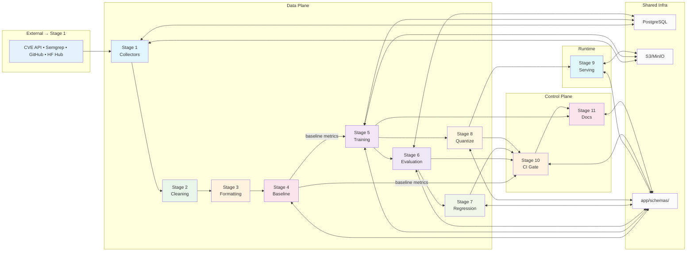

# Vuln-Triage-Harness — Complete Architecture

> 11-stage vulnerability triage & fine-tuning pipeline.
> **Core principle:** Every external dependency is a `Protocol` with a mock implementation. Heavy ML deps are lazy-loaded. Zero-dependency at import time.

---

## 📊 1. Overall Pipeline Flow (11 Stages)

```mermaid
flowchart LR
    subgraph "Inputs"
        CVE[CVE / NVD API]
        SEMGREP[Semgrep Rules\n(app/data/collectors/rules/)]
        GH[GitHub Repos]
        HF[HuggingFace Hub]
    end

    subgraph S1["Stage 1: Data Collection<br/>app/data/collectors/"]
        S1A[collect_pipeline.py] --> S1B[nvd_client.py]
        S1A --> S1C[semgrep_runner.py]
        S1A --> S1D[cvefixes_loader.py\n+ cvefixes_reduced_loader.py]
        S1A --> S1E[cwe_scope.py — 6 CWE enum]
    end

    subgraph S2["Stage 2: Cleaning & Split<br/>app/data/cleaning/"]
        S2A[pipeline.py — orchestrator]
        S2B[dedup.py — cosine similarity]
        S2C[split.py — repo-grouped leak-safe]
        S2D[contamination.py — n-gram overlap]
        S2E[embeddings.py — lazy sentence-transformers]
        S2F[hf_dataset.py — datasets.DatasetDict]
        S2G[cli.py — Typer CLI]
    end

    subgraph S3["Stage 3: Formatting<br/>app/data/formatting/"]
        S3A[builder.py — build_examples]
        S3B[template.py — SYSTEM_PROMPT\n+ PROMPT_TEMPLATE\n+ format_prompt\n+ make_patch_diff]
        S3C[tokenizer.py — TokenCounter\n(TokenBackend Protocol\n+ regex heuristic)]
        S3D[pipeline.py + cli.py]
    end

    subgraph S4["Stage 4: Baseline Eval<br/>app/evaluation/"]
        S4A[baseline.py — run_baseline()]
        S4B[prompt.py — build_zero_shot_prompt\nbuild_few_shot_prompt]
        S4C[backends.py — ModelBackend Protocol\nQwenBackend (lazy transformers)\nMockBackend]
        S4D[parser.py — parse_prediction\n4-step extraction\n_template_detection]
        S4E[metrics.py — BaselineMetrics\n+ compute_metrics\n(cwe_macro_f1,\nhallucination_rate,\npatch_coverage)]
        S4F[cli.py — Typer CLI]
    end

    subgraph S5["Stage 5: Training<br/>app/training/"]
        S5A[trainer_sft.py — SFT/QLoRA]
        S5B[trainer_dpo.py — DPO via TRL]
        S5C[sweep.py — LoRA rank sweep]
        S5D[experiment.py — PostgreSQL + JSON fallback]
        S5E[config.py — SFTConfig/DPOConfig/SweepConfig]
        S5F[callbacks.py — TrainingCallback Protocol\nResourceTracker / CheckpointCallback\nWandbCallback / ProgressCallback]
        S5G[data.py + cli.py]
    end

    subgraph S6["Stage 6: 4-Tier Eval<br/>app/evaluation/"]
        S6A[runner.py — EvaluationRunner\nEvalConfig\ncompute_metrics → EvalMetrics]
        S6B[tier1_deterministic.py\n22 PatternRules → 6 CWEs\nDeterministicEvaluator]
        S6C[tier2_embedding_static.py\n19 rule_id→CWE mappings\nEmbeddingBackend (lazy)\nStaticSignalEvaluator]
        S6D[tier3_exec.py\napply_unified_diff (pure Python)\nTestGenerator (6 CWE templates)\nSandboxRunner Protocol:\n  LocalSandboxRunner\n  DockerSandboxRunner\n  MockSandboxRunner\ncheck_hallucinated_function_ref]
        S6E[tier4_llm_judge.py\nLlmJudgeBackend Protocol\nMockLlmJudgeBackend\nLocalLlmJudgeBackend\n_OpenAiBackend\n_parse_judge_response (3-tier)]
    end

    subgraph S7["Stage 7: Regression<br/>app/evaluation/"]
        S7A[general_capability.py\n12 non-security tasks\nCodeTestRunner Protocol:\n  LocalCodeTestRunner\n  DockerCodeTestRunner\n  MockCodeTestRunner\n_sanitize_paths]
    end

    subgraph S8["Stage 8: Quantization<br/>app/quantization/"]
        S8A[quantizer.py — Quantizer Protocol\nMockQuantizer\nrun_quantization_matrix\nquantize_single\nselect_best_config\nscore_quality_size_speed (0.6/0.2/0.2)]
        S8B[config.py — QuantConfig\nGPTQConfig / AWQConfig / GGUFConfig]
        S8C[export_gptq.py — GPTQQuantizer]
        S8D[export_awq.py — AWQQuantizer]
        S8E[export_gguf.py — GGUFQuantizer\n+ gguf_type_to_bits]
        S8F[cli.py]
    end

    subgraph S9["Stage 9: Serving<br/>app/serving/"]
        S9A[serve.py — VulnerabilityServer\nfrom_config + serve_sample + serve_batch\n(reuses Stage 4 prompt+parser)]
        S9B[backends.py — ServingBackend Protocol\nLlamaCppBackend (llama-cpp-python)\nLlamaServerBackend (HTTP subprocess)\nTransformersBackend (HF format)\nOllamaBackend (HTTP API)\nMockServingBackend]
        S9C[config.py — ServingConfig (frozen)\nall_warnings()]
        S9D[api.py — FastAPI 3 endpoints\n/serve /serve/batch /manifest\n/healthz]
        S9E[cli.py — Typer CLI]
    end

    subgraph S10["Stage 10: CI Gate<br/>app/ci/"]
        S10A[gate.py — RegressionGate\nload_baseline_metrics\nload_stage6_report\nload_stage7_report\n4 checks:\n  f1_regression (≤5% drop)\n  forgetting (≥-0.10)\n  exec_pass_rate (≥0.0)\n  hallucination (≤50%)\nparse_gitleaks_output\nparse_trivy_output]
        S10B[config.py — RegressionGateConfig (frozen)]
        S10C[security_scanners.py — SecurityScanSummary]
    end

    subgraph S11["Stage 11: Docs<br/>app/stage11/"]
        S11A[generator.py — Stage11Generator\nload_artifacts (fallback)\nensure_deliverables\nvalidate_deliverables\nrun_demo]
        S11B[config.py — Stage11Config (frozen)\n_derive_model_name]
    end

    subgraph ST["Storage Layer"]
        PG[(PostgreSQL\napp/storage/db.py\nVulnSampleRow\nTrainingRunRow)]
        S3[(MinIO / S3\napp/storage/object_store.py\nget_client / put_json / get_json)]
        JF[Local JSON Fallback\noutput/stage*/ dir]
    end

    CVE --> S1A
    SEMGREP --> S1A
    GH --> S1A
    HF --> S5A

    S1A -->|VulnSample JSONL| S2A
    S2F -->|train/val/test/gold_eval| S3A
    S3D -->|InstructionExample JSONL| S4A
    S4A -->|predictions.jsonl\nmetrics.json| S5A
    S4A -->|baseline metrics| S10A
    S5A -->|checkpoint| S3
    S5D --> PG
    S5A --> S8A
    S5A --> S11A
    S4A -->|metrics| S6A
    S6A -->|eval_report.json| S10A
    S6A -->|EvalReport| S7A
    S7A -->|regression_report.json| S10A
    S8A -->|quant_report.json| S10A
    S8E --> S9A
    S10A -->|gate_result.json\nci_report.json| S11A
    PG -.-> S2A
    S3 -.-> S5A
    PG -.-> S6A
    S3 -.-> S9A

    style S1 fill:#e1f5fe
    style S2 fill:#e8f5e9
    style S3 fill:#fff3e0
    style S4 fill:#fce4ec
    style S5 fill:#f3e5f5
    style S6 fill:#ede7f6
    style S7 fill:#f1f8e9
    style S8 fill:#fff8e1
    style S9 fill:#e0f7fa
    style S10 fill:#fff3e0
    style S11 fill:#fce4ec
    style ST fill:#fafafa
```

---

## 🔌 2. Injectable Backend Pattern (Across All Stages)

```mermaid
flowchart TB
    subgraph Pattern["The Injectable Backend Pattern"]
        direction TB
        P[Protocol] -->|implements| Prod[Production Impl\n(e.g. QwenBackend)]
        P -->|implements| Mock[Mock Impl\n(e.g. MockBackend)]

        Prod -->|lazy import inside method| Deps["torch / transformers / peft\nsentence-transformers / auto_gptq / autoawq\nllama_cpp / httpx / docker / boto3"]
        Mock -->|no deps| Clean["Tests run without GPU\nor model downloads"]
    end

    subgraph Backends["Backend Implementations by Stage"]
        direction TB
        B1["Stage 2: EmbeddingBackend\n(lazy sentence-transformers)"]
        B2["Stage 3: TokenBackend Protocol\n(TokenCounter)"]
        B3["Stage 4-7: ModelBackend Protocol\nQwenBackend / MockBackend"]
        B4["Stage 6: SandboxRunner Protocol\nLocalSandboxRunner / DockerSandboxRunner / MockSandboxRunner"]
        B5["Stage 6: LlmJudgeBackend Protocol\nMockLlmJudgeBackend / LocalLlmJudgeBackend / _OpenAiBackend"]
        B6["Stage 6: CodeTestRunner Protocol\nLocalCodeTestRunner / DockerCodeTestRunner / MockCodeTestRunner"]
        B7["Stage 8: Quantizer Protocol\nGPTQQuantizer / AWQQuantizer / GGUFQuantizer / MockQuantizer"]
        B8["Stage 9: ServingBackend Protocol\nLlamaCpp / LlamaServer / Transformers\nOllama / MockServingBackend"]
    end

    P -.->|"structural typing"| B1
    P -.-> B2
    P -.-> B3
    P -.-> B4
    P -.-> B5
    P -.-> B6
    P -.-> B7
    P -.-> B8
```

---

## ⚖️ 3. Four-Tier Evaluation Escalation (Stage 6)

```mermaid
flowchart TD
    T1["Tier 1: Deterministic\n(app/evaluation/tier1_deterministic.py)\n\nDeterministicEvaluator\n• PatternRule dataclass (frozen)\n• DEFAULT_TIER1_RULES: 22 rules across 6 CWEs\n  — CWE-89: 5 patterns (f-string, concat, printf-style, SELECT, f\"SELECT)\n  — CWE-79: 4 patterns (innerHTML, outerHTML, document.write, .send concat)\n  — CWE-22: 2 patterns (open() with +, open(var,))\n  — CWE-78: 4 patterns (shell=True, os.system, os.popen, subprocess+concat)\n  — CWE-190: 4 patterns (bytearray, [0]*, <<, multiplication)\n  — CWE-502: 3 patterns (pickle.loads, yaml.load, yaml.load+Loader)\n• Confidence: 0.55–0.99\n• evaluate(sample) → Tier1Result\n  (predicted_cwe, confidence, matched_pattern, num_matched)\n\nOutput: Tier1Result"]

    T2["Tier 2: Static Signal + Embedding\n(app/evaluation/tier2_embedding_static.py)\n\nStaticSignalEvaluator\n• DEFAULT_RULE_TO_CWE: 19 semgrep rule→CWE mappings\n• Vote across findings → predicted_cwe\n• EmbeddingBackend (lazy sentence-transformers)\n  intfloat/multilingual-e5-base\n• cosine similarity: predicted patch vs gold fix\n• _cosine_similarity (pure Python)\n• evaluate(sample, prediction) → Tier2Result\n  (signal_sources, embedding_similarity)\n\nOutput: Tier2Result"]

    T3["Tier 3: Exec Sandbox\n(app/evaluation/tier3_exec.py)\n\nExecEvaluator\n• apply_unified_diff(source, diff)\n  — Pure Python (no git/patch dep)\n  — Brace-matching parser for @@ hunks\n  — Context verification + error messages\n• _TEST_TEMPLATES: 6 per-CWE test templates (AST-based)\n  — CWE-89: ast.parse, check no JoinedStr in .execute()\n  — CWE-79: check no innerHTML/outerHTML/document.write\n  — CWE-22: check realpath/abspath + startswith/commonpath\n  — CWE-78: check no shell=True/os.system/os.popen\n  — CWE-190: check OverflowError/raise/if guard\n  — CWE-502: ast.walk, check no pickle/unsafe yaml.load\n• SandboxRunner(Protocol)\n  — LocalSandboxRunner: subprocess, temp dir\n  — DockerSandboxRunner: --read-only --network none\n    user UID 1000, 512MB mem limit\n  — MockSandboxRunner: canned results\n• check_hallucinated_function_ref(code, patch)\n• evaluate(sample, prediction) → ExecEvalResult\n  (patch_applies, build_succeeds,\ntests_pass, hallucinated_cwe,\nhallucinated_function_ref)\n\nOutput: ExecEvalResult"]

    T4["Tier 4: LLM Judge\n(app/evaluation/tier4_llm_judge.py)\n\nLlmJudge\n• JUDGE_PROMPT template:\n  CWE + description + vuln_code\n  + patch_diff + rationale →\n  JSON: {explanation_quality, patch_minimality, rationale}\n• _parse_judge_response (3-tier fallback):\n  1. strict json.loads\n  2. _find_json_objects brace-matching\n  3. regex extraction for truncated JSON\n• LlmJudgeBackend(Protocol)\n  — MockLlmJudgeBackend (default 0.5/0.5)\n  — LocalLlmJudgeBackend (HF model)\n  — _OpenAiBackend (OpenAI-compatible API)\n• evaluate(sample, prediction) → LlmJudgeScore\n\nOutput: LlmJudgeScore"]

    T1 -->|samples| T2
    T2 -->|samples + predictions| T3
    T3 -->|samples + predictions| T4
    T4 -->|aggregate all tiers| METRICS["compute_metrics (runner.py)\n→ EvalMetrics / EvalReport\n\nMetrics:\n• tier1_cwe_macro_f1 / coverage\n• tier2_cwe_macro_f1 / coverage\n• model_cwe_macro_f1\n• exec_pass_rate / patch_applies_rate\n• build_succeeds_rate\n• hallucination_rate\n• avg_patch_coverage\n• avg_explanation_quality (T4)\n• avg_patch_minimality (T4)\n• per_class F1\n\nOutput: eval_report.json"]

    style T1 fill:#e3f2fd
    style T2 fill:#e8f5e9
    style T3 fill:#fff3e0
    style T4 fill:#f3e5f5
    style METRICS fill:#ede7f6
```

---

## 🛠️ 4. Stage 4: Baseline Evaluation (Detailed)

```mermaid
flowchart LR
    subgraph Stage4["Stage 4: Baseline Evaluation"]
        A[VulnSample JSONL\n(gold_eval split)] --> B[run_baseline()]
        C[InstructionExample JSONL\n(train split)] --> D[build_few_shot_prompt\n(prompt.py)]

        B --> E{Strategy?}
        E -->|zero_shot| F[build_zero_shot_prompt\n(prompt.py)]
        E -->|few_shot| D
        F --> G[backend.generate\n(ModelBackend Protocol)]
        D --> G
        G --> H[parse_prediction\n(parser.py)\n4-step JSON extraction\n→ ModelPrediction | ParseError]
        H --> I[compute_metrics\n(metrics.py)\n→ BaselineMetrics]
        I --> J[predictions.jsonl\nmetrics.json\nmanifest.json]
        G -.->|"MockBackend"| K[Tests]
    end

    subgraph "Parser 4-Step Extraction"
        P1[Strip bare ``` fences\n(not language-tagged)]
        P2[Find ```json … ``` blocks\n→ _JSON_FENCE_RE\nSkip template\n("_is_template_json")]
        P3[Brace-match all {…}\nvia _find_json_objects\n(brace counting\nwith string-aware nesting)]
        P4[Regex fallback\n_TTLBACK_*_RE regexes\nfor unescaped quotes\nin patch_diff]
    end

    H -.->|uses| P1
    P1 --> P2
    P2 --> P3
    P3 --> P4
```

**Files:**
| File | Key Functions/Classes |
|------|----------------------|
| `app/evaluation/baseline.py` | `run_baseline()`, `BaselineConfig`, `BaselineResult` |
| `app/evaluation/prompt.py` | `build_zero_shot_prompt()`, `build_few_shot_prompt()`, `RESPONSE_FORMAT_INSTRUCTION` (reuses `format_prompt` from Stage 3) |
| `app/evaluation/backends.py` | `ModelBackend` Protocol, `QwenBackend` (lazy `transformers`+`peft`), `MissingAdapterWeightsError`, `MockBackend` |
| `app/evaluation/parser.py` | `parse_prediction()`, `ParseError`, `_extract_json`, `_find_json_objects`, `_is_template_json`, `_try_fallback_extract` |
| `app/evaluation/metrics.py` | `BaselineMetrics`, `compute_metrics()` (baseline-specific: `cwe_macro_f1`, `cwe_micro_accuracy`, `severity_accuracy`, `hallucination_rate`, `patch_coverage`) |
| `app/evaluation/cli.py` | Typer CLI for baseline runs |

**Critical Fix — `MissingAdapterWeightsError`:**
When a LoRA adapter directory has `adapter_config.json` but no `adapter_model.safetensors`/`.bin`, the `QwenBackend` raises this error by default instead of silently falling back to the base model. This prevents a false `forgetting_delta == 0.0` in Stage 7. Callers must explicitly set `allow_base_fallback=True` to skip this guard.

---

## 🏋️ 5. Stage 5: Fine-Tuning (SFT / QLoRA / LoRA / DPO)

```mermaid
flowchart LR
    subgraph Stage5["Stage 5: Fine-Tuning"]
        A[InstructionExample JSONL] --> B[run_sft / run_dpo]
        B --> C[Lazy Import\ntorch + transformers + peft +\nBitsAndBytesConfig + trl]
        C --> D[_check_can_train()\nRuntimeError if missing\nCUDA required for QLoRA\nCPU allowed for LoRA]
        D --> E[Training Loop\nwith Callbacks:]
        E --> E1[WandbCallback\n(mock=True or wandb)]
        E --> E2[CheckpointCallback\n→ MinIO upload\nper-file boto3 put_object]
        E --> E3[ProgressCallback\n(console)]
        E --> E4[ResourceTracker\npeak VRAM + wall time]
        E --> F[TrainingResult\n+ loss history]
        F --> G[persist_training_run\n→ PostgreSQL\n+ JSON fallback]
        F --> H[CheckpointCallback.save_checkpoint\n→ s3://bucket/checkpoints/stage5/{run_id}/epoch_{epoch}/]
    end

    subgraph "Training Methods"
        M1[SFT Full\n(4-bit QLoRA\nbitsandbytes nf4)\nBitsAndBytesConfig]
        M2[SFT LoRA\n(bfloat16/float32\nCPU fallback)\nPEFT LoraConfig]
        M3[LoRA Sweep\n ranks: 8,16,32,64,128\nselect best by val loss]
        M4[DPO\nTRL DPOTrainer\npreference pairs\nbeta=0.1, sigmoid loss\n4-bit QLoRA loading\nFSDP compat shim]
    end

    B --> M1
    B --> M2
    B --> M3
    M2 --> M4
```

**Files:**
| File | Key Classes/Functions |
|------|----------------------|
| `app/training/trainer_sft.py` | `SFTConfig`, `_run_sft`, `run_sft`, QLoRA with `BitsAndBytesConfig(nf4)`, CPU fallback, `dry_run` mode |
| `app/training/trainer_dpo.py` | `DPOConfig`, `_run_dpo`, `run_dpo` (TRL `DPOTrainer`), preference pair construction |
| `app/training/sweep.py` | `SweepConfig`, `run_sweep` (LoRA ranks 8-128), `SweepResult` |
| `app/training/experiment.py` | `persist_training_run()` (PostgreSQL `TrainingRunRow` + JSON fallback) |
| `app/training/config.py` | `SFTConfig`, `DPOConfig`, `SweepConfig` dataclasses |
| `app/training/callbacks.py` | `TrainingCallback` Protocol, `ResourceTracker`, `CheckpointCallback`→MinIO, `WandbCallback`, `ProgressCallback` |
| `app/training/data.py` | `load_examples()`, `JsonlDataLoader` |
| `app/training/cli.py` | Typer CLI for SFT/DPO/sweep |

---

## 📦 6. Storage Layer — PostgreSQL + MinIO / S3 Split

```mermaid
erDiagram
    DB {
        SQLAlchemy DeclarativeBase Base
        Engine get_engine()
        Session get_session()
        void init_db()
    }

    DB ||--o{ VulnSampleRow : "tracks"
    DB ||--o{ TrainingRunRow : "tracks"

    VulnSampleRow {
        id str PK
        source str "cve_real|synthetic|ctf"
        repo_name str "leakage-safe split key"
        commit_sha str
        cwe_id str "CWE-89..CWE-502"
        severity str "low|medium|high|critical"
        language str
        description str
        static_findings JSON
        split str "train|val|test|gold_eval"
        object_store_key str "MinIO pointer"
        created_at str
    }

    TrainingRunRow {
        id str PK
        run_name str
        method str "sft_full|sft_qlora|lora|dpo"
        base_model str
        hyperparams JSON
        train_set_size str
        train_time_minutes str
        peak_vram_gb str
        final_train_loss str
        final_val_loss str
        checkpoint_uri str "S3 path"
        status str "pending|running|completed|failed"
        created_at str
    }

    ObjectStore {
        str DEFAULT_BUCKET "vuln-triage"
        client get_client()
        void ensure_bucket()
        str put_json(key, payload)
        dict get_json(key)
    }

    VulnSampleRow ||--o{ ObjectStore : "object_store_key →"
    TrainingRunRow ||--o{ ObjectStore : "checkpoint_uri →"
    DB }o--|| JSONFallback : "fallback when PG offline"

    JSONFallback {
        output/stage2/splits.json
        output/stage5/training_result.json
        output/stage6/eval_report.json
        output/stage7/regression_report.json
        output/stage8/quant_report.json
        output/stage10/gate_result.json
        output/stage10/ci_report.json
    }
```

**Schema Contracts** (`app/schemas/`):

| File | Models |
|------|--------|
| `vuln.py` | `VulnSample`, `StaticFinding` |
| `dataset.py` | `InstructionExample` |
| `prediction_eval.py` | `ModelPrediction`, `Tier1Result`, `Tier2Result`, `ExecEvalResult`, `LlmJudgeScore`, `EvalMetrics`, `EvalReport`, `GeneralCapabilityResult`, `GeneralCapabilityMetrics`, `RegressionReport`, `RegressionSummary` |
| `training.py` | `TrainingRun`, `TrainingResult`, `SweepResult` |
| `quantization.py` | `QuantMethod` (StrEnum), `QuantStatus`, `QuantResult`, `QuantReport`, `QuantRecommendation` |
| `serving.py` | `ServeRequest`, `ServeResponse`, `BatchServeRequest`, `BatchServeResponse`, `ServeManifest` |
| `ci.py` | `GateStatus`, `GateCheck`, `RegressionGateResult`, `SecurityScanSummary`, `CiReport` |
| `documentation.py` | `CWE_SCOPE`, `LANGUAGE_SCOPE`, `BASE_MODEL`, `EvalMetricsSnapshot`, `TrainingRunData`, `QuantResultData`, `ModelCardData`, `TrainingReportData`, `DemoResult` |

**Key Design Decisions:**
- **Metadata in Postgres, payloads in S3:** Only queryable metadata (CWE, severity, repo_name, split) lives in the DB; full code payloads and model checkpoints live in MinIO/S3
- **JSON fallback everywhere:** Every stage writes JSON to `output/stageN/` as a file-based fallback when Postgres is unavailable
- **Leakage-safe splits:** Grouping by `repo_name` (not individual samples) prevents the same repository appearing in both train and test

---

## 🎯 7. Stage 7: Regression / Forgetting Analysis

```mermaid
graph LR
    subgraph Stage7["Stage 7: Regression Analysis"]
        A[Base Model\n(QwenBackend, allow_base_fallback=True)] --> B[GeneralCapabilityEvaluator]
        C[Tuned Model\n(QwenBackend with LoRA)] --> B
        B --> D["12 Algorithm Tasks\n(app/evaluation/general_capability.py)\nDEFAULT_GENERAL_TASKS:\n• factorial\n• is_palindrome\n• fibonacci\n• binary_search\n• two_sum\n• reverse_int\n• longest_common_prefix\n• max_subarray_sum\n• is_valid_parentheses\n• count_vowels\n• is_anagram\n• merge_sorted_arrays\n\nAll stdlib-only — no external deps\nto keep sandbox self-contained"]
        D --> E[CodeTestRunner Protocol]
        E --> E1[LocalCodeTestRunner\nsubprocess + temp dir]
        E --> E2[DockerCodeTestRunner\nisolated container]
        E --> E3[MockCodeTestRunner\n(canned results)]
        E --> F[Solution: generate → write\nto temp dir → run pytest\n→ pass/fail]
        F --> G[GeneralCapabilityMetrics\nexecution_accuracy = passed/total]
        F --> H[_sanitize_paths\n(redacts /tmp/ paths\nfrom pytest output)]
        G --> I[forgetting_delta =\ntuned_acc - base_acc\n(negative = forgetting)]
        I --> J[RegressionReport\n+ RegressionSummary\n→ regression_report.json]
        J -->|"→ Stage 10 Gate"| K
    end

    style Stage7 fill:#f1f8e9
```

---

## ⚙️ 8. Stage 8: Quantization Matrix

```mermaid
graph LR
    subgraph Stage8["Stage 8: Quantization Matrix"]
        A[Stage 5 Checkpoint\nfull-precision] --> B[run_quantization_matrix\n(quantizer.py)]
        B --> C[QuantConfig\nmethods × bit_widths]
        C --> D1[GPTQQuantizer\nauto-gptq 2-4 bit\n(group_size 128)]
        C --> D2[AWQQuantizer\nautoawq 2-5 bit\n(group_size 128)]
        C --> D3[GGUFQuantizer\nllama.cpp: Q2_K, Q3_K,\nQ4_0, Q4_K, Q5_K,\nQ8_0, F16]
        D1 --> E[QuantResult\nper method × bits]
        D2 --> E
        D3 --> E
        E --> F[select_best_config\nfilters: COMPLETED\ntarget_vram_gb / target_size_gb\nscore = 0.6×quality\n+ 0.2×size\n+ 0.2×speed\n\n• size_score = 1 - size_gb/14.0\n• speed_score = min(1, tps/30.0)\n• quality = model_cwe_macro_f1\n  (fallback: estimate_quality)\n\nReturn: max(score)]
        F --> G[QuantReport\n+ best_result\n+ manifest\n→ quant_report.json]
        G -->|"→ Stage 10 Gate"| H
        G -->|"best GGUF"| I["Stage 9 Serving"]
        B -->|"mock=True"| JM[MockQuantizer\ndeterministic\nheuristic estimates]
        B -->|"dry_run=True"| DR[heuristic estimates\n(no real quant)]
    end

    style Stage8 fill:#fff8e1
```

**Scoring Constants** (`quantizer.py`):
- `_QUALITY_WEIGHT = 0.6`
- `_SIZE_WEIGHT = 0.2`
- `_SPEED_WEIGHT = 0.2`

**Baseline normalization:** FP16 = 14 GB / ~30 t/s (7B model on GPU)

---

## 🚀 9. Stage 9: Air-Gapped Serving

```mermaid
graph LR
    subgraph Stage9["Stage 9: Serving"]
        A[GGUF checkpoint\n(from Stage 8 best)] --> B[VulnerabilityServer\n(serve.py)]
        B --> C["build_zero_shot_prompt\n(reuse Stage 4 prompt.py)\n→ model.generate\n→ parse_prediction\n→ ServeResponse"]
        C --> D[ServingBackend Protocol]
        D --> E1[LlamaCppBackend\nllama-cpp-python\n(lazy import)\nCPU/GPU n_gpu_layers]
        D --> E2[LlamaServerBackend\nllama-server.exe subprocess\n+ HTTP /completion\n(lazy httpx import)]
        D --> E3[TransformersBackend\nHF format model.safetensors\n(torch + transformers)\nGPU fallback\nwhen llama.cpp unavailable]
        D --> E4[OllamaBackend\nlocal HTTP API\nhttp://localhost:11434\n(lazy httpx)]
        D --> E5[MockServingBackend\n(deterministic)\nfor tests]
        B --> F["from_config(ServingConfig)\nbackend factory:\n  llama.cpp → LlamaCppBackend\n  llama-server → LlamaServerBackend\n  ollama → OllamaBackend\n  mock → MockServingBackend"]

        subgraph "API Layer"
            G[create_app\n(api.py)\nFastAPI\n3 endpoints:\n  POST /api/v1/serve\n  POST /api/v1/serve/batch\n  GET /api/v1/manifest\n  GET /healthz]
            H[cli.py\nTyper CLI\nserve / serve-batch]
        end

        F --> G
        G --> H
    end

    style Stage9 fill:#e0f7fa
```

---

## 🚦 10. Stage 10: CI Regression Gate

```mermaid
graph LR
    subgraph Stage10["Stage 10: CI Regression Gate"]
        A[Stage 4\nmetrics.json] --> B[RegressionGate]
        C[Stage 6\neval_report.json] --> B
        D[Stage 7\nregression_report.json] --> B
        E[Stage 8\nquant_report.json] --> B
        B --> F["4 Gate Checks:\n\n① check_f1_regression\n  baseline_cwe_macro_f1\n  vs current_cwe_macro_f1\n  FAIL if drop > 5.0%\n\n② check_forgetting\n  forgetting_delta < -0.10\n  SKIP if Stage 7 absent\n\n③ check_exec_pass_rate\n  FAIL if exec_pass_rate < 0.0\n  (configurable floor)\n\n④ check_hallucination_rate\n  FAIL if > 0.50\n  (50% threshold)"]
        B --> G["Artifact Loaders:\n  load_baseline_metrics\n    → FileNotFoundError\n    → RuntimeError (missing key)\n  load_stage6_report\n    → tolerates nested\n      or flattened structure\n  load_stage7_report\n    → requires forgetting_delta\n  load_quant_report (optional)"]
        F --> H[RegressionGateResult\nstatus: PASS|FAIL\nchecks: [GateCheck×4]\nmanifest: config + paths]
        B --> I["Security Scans:\nparse_gitleaks_output\n→ SecurityScanSummary\nparse_trivy_output\n→ SecurityScanSummary"]
        H --> J[CiReport\noverall_status: PASS|FAIL\n(gate + gitleaks + trivy)\n→ ci_report.json]
        J -->|"CI verdict"| CI[CI/CD Pipeline]
        J -->|"→ Stage 11"| K
    end

    style Stage10 fill:#fff3e0
```

**Files:**
| File | Key Functions/Classes |
|------|----------------------|
| `app/ci/gate.py` | `RegressionGate` class, `run_gate()`, `load_baseline_metrics()`, `load_stage6_report()`, `load_stage7_report()`, `parse_gitleaks_output()`, `parse_trivy_output()` |
| `app/ci/config.py` | `RegressionGateConfig` (frozen dataclass with threshold defaults) |
| `app/ci/security_scanners.py` | Gitleaks + Trivy output parsers → `SecurityScanSummary` |

**Schema** (`app/schemas/ci.py`): `GateStatus` (StrEnum: PASS/FAIL/SKIP), `GateCheck` (name, status, message, details), `RegressionGateResult` (status, run_id, timestamp, baseline/current F1, f1_drop_percent, exec_pass_rate, hallucination_rate, forgetting_delta, checks, manifest), `SecurityScanSummary` (tool, status, findings_count, severity_counts), `CiReport` (run_id, gate, gitleaks, trivy, overall_status)

---

## 📄 11. Stage 11: Documentation Generation

```mermaid
graph LR
    subgraph Stage11["Stage 11: Documentation"]
        A[Stage 4\nmetrics.json] --> B[Stage11Generator\n(generator.py)]
        C[Stage 5\nTrainingRunRow] --> B
        D[Stage 6\neval_report.json] --> B
        E[Stage 7\nregression_report.json] --> B
        F[Stage 8\nquant_report.json] --> B
        G[Stage 10\ngate_result.json\nci_report.json] --> B
        B --> H["load_artifacts\n(gold/silver/bronze\nfallback chain)\n\nIf Stage 6 report missing:\n  gold → eval_report.json\n  silver → metrics.json\n  bronze → mock defaults\n\nIf Stage 5 record missing:\n  gold → postgres TrainingRunRow\n  silver → training_result.json\n  bronze → config defaults"]

        H --> I["ensure_deliverables:"]
        I --> I1[docs/model_card.md\ngenerate_model_card_markdown\n(ModelCardData)\n\nFields:\n  model_name, base_model\n  training_method, lora_rank\n  quant_method, quant_bit_width\n  cwe_scope, eval metrics\n  limitations, ethical_considerations"]

        I --> I2[docs/training_report.md\ngenerate_training_report\n(TrainingReportData)\n\nFields:\n  training_runs[],\n  baseline/tuned/quant metrics\n  gate_result\n  conclusions, recommendations"]

        I --> I3[docs/demo.py\n_DEMO_TEMPLATE\n\nExecutable demo:\n  1. MockServingBackend\n  2. Sample vulnerable code\n  3. Run inference\n  4. Print prediction\n  5. Run 4-tier eval\n  6. Print metrics"]

        B --> J[validate_deliverables\n(exists + non-empty)]
        B --> K[run_demo\n(mock subprocess)]
    end

    style Stage11 fill:#fce4ec
```

---

## 📋 12. Test Coverage Matrix

```mermaid
graph LR
    subgraph Tests["Test Suites"]
        subgraph Unit["tests/unit/"]
            U1[test_evaluation_backends.py\nMockBackend response mapping\nMockBackend call tracking\nQwenBackend constructor storage\nLazy loading behavior\nMissingAdapterWeightsError\nadapter_applied flag\nProtocol compatibility]

            U2[test_evaluation_runner.py\n_compute_cwe_macro_f1 edge cases\n_compute_coverage\nEvaluationRunner tier injection\nSandbox modes: local/docker/mock\nload_samples / load_predictions\nrun() end-to-end with mocks]

            U3[test_evaluation_parser.py\nparse_prediction\n_is_template_json\n_extract_json\n_find_json_objects\n_try_fallback_extract\nParseError handling]

            U4[test_evaluation_metrics.py\nBaselineMetrics fields\ncompute_metrics\nper-class F1\nhallucination rate\npatch coverage]

            U5[test_evaluation_prompt.py\nbuild_zero_shot_prompt\nbuild_few_shot_prompt\nRESPONSE_FORMAT_INSTRUCTION\nformat_prompt reuse]

            U6[test_tier1_deterministic.py\nPatternRule matching\nconfidence ranking\nno-match → None\nDEFAULT_TIER1_RULES count\nclassify_deterministic]

            U7[test_tier2_embedding_static.py\nDEFAULT_RULE_TO_CWE mapping\nSemgrep vote → CWE\nEmbeddingBackend lazy load\n_cosine_similarity\nStaticSignalEvaluator.evaluate]

            U8[test_tier3_exec.py\napply_unified_diff\n_parse_diff_hunks\n_find_first_mismatch\n_TEST_TEMPLATES (6 CWEs)\nTestGenerator\nsandbox modes\ncheck_hallucinated_function_ref\nLocalSandboxRunner\nMockSandboxRunner]

            U9[test_tier4_llm_judge.py\nJUDGE_PROMPT formatting\n_parse_judge_response\n3-tier fallback:\n  strict JSON → brace-match → regex\nMockLlmJudgeBackend\nLlmJudge.invoke / evaluate\n_OpenAiBackend fallback]

            U10[test_baseline.py\nrun_baseline\nBaselineConfig\nBaselineResult\nparse_errors\nMockBackend injection]

            U11[test_vulnerability_server.py\nVulnerabilityServer.serve_sample\nserve_batch\nfrom_config\nMockServingBackend\nparse_prediction integration]

            U12[test_serving_backends.py\nLlamaCppBackend._load\nmock mode\ngenerate output parsing\nLlamaServerBackend lifecycle\nOllamaBackend\nTransformersBackend\nMockServingBackend\nServingBackend Protocol\n_import_httpx\n_find_hf_model_dir\n_find_llama_server]

            U13[test_serving_config.py\nServingConfig validation\nall_warnings\nboundary conditions\nbackend_type validation]

            U14[test_quantization.py\nQuantizer Protocol\nMockQuantizer\nquantize_single\ndry_run / mock modes\nselect_best_config filters\nscore_quality_size_speed\n_NoOpQuantizer]

            U15[test_stage10_gate.py\nRegressionGate\n4 checks:\n  check_f1_regression\n  check_forgetting (SKIP)\n  check_exec_pass_rate\n  check_hallucination_rate\nload_baseline/stage6/stage7\nparse_gitleaks_output\nparse_trivy_output\nRegressionGateConfig (frozen)\nrun_gate end-to-end]

            U16[test_training_trainer_sft.py\n_check_can_train\ndry_run mode\nTrainingResult\nResourceTracker\nConfig validation\nCallback injection]

            U17[test_training_trainer_dpo.py\nDPOTrainer integration\nPreference pair construction\nFSDP shim\nTrainingResult fields]

            U18[test_training_callbacks.py\nWandbCallback mock mode\nCheckpointCallback mock → MinIO\nProgressCallback\nResourceTracker VRAM\nTrainingCallback Protocol]

            U19[test_training_experiment.py\npersist_training_run\nPostgreSQL + JSON fallback\nTrainingRunRow mapping\nload_training_run]

            U20[test_general_capability.py\nDEFAULT_GENERAL_TASKS (12)\n_gc_task constructor\nCodeTestRunner Protocol\nLocalCodeTestRunner\nsubprocess safety (_sanitize_paths)\nMockCodeTestRunner\nforgetting_delta calc]

            U21[test_stage11_documentation.py\nStage11Config (frozen)\n_derive_model_name\ngenerate_model_card_markdown\ngenerate_training_report\ngenerate_demo_script\nload_artifacts fallback chain\nensure_deliverables\nvalidate_deliverables\nrun_demo (mocked\nsubprocess)]
        end

        subgraph Integration["tests/integration/"]
            I1[test_stage1_pipeline.py\nCVE → Semgrep → DB]
            I2[test_stage2_pipeline.py\nDedup + split + contaminate]
            I3[test_stage3_pipeline.py\nVulnSample → InstructionExample]
            I4[test_stage4_baseline.py\nEnd-to-end baseline\nwith MockBackend]
            I5[test_stage5_training.py\ndry_run SFT/QLoRA/DPO\ntraining_result.json\nLoss curve generation]
            I6[test_stage6_four_tier.py\nEvaluationRunner\nall 4 tiers\nEvalReport output\ncompute_metrics]
            I7[test_stage7_regression.py\nGeneralCapabilityEvaluator\nforgetting analysis\nLocalCodeTestRunner]
            I8[test_stage8_quantization.py\nQuantizationMatrix\nQuantReport\nselect_best_config\ndry_run estimation]
            I9[test_stage9_serving.py\nVulnerabilityServer\nend-to-end\nMockServingBackend\nServeResponse]
            I10[test_stage10_ci.py\nRegressionGate end-to-end\nCiReport\nSecurityScanSummary\nGateCheck statuses]
            I11[test_stage11_docs.py\nStage11Generator\nall 3 deliverables\nFile existence + content]
        end

        subgraph CodeQuality["tests/code_quality/"]
            CQ1[test_mypy_types.py\nmypy strict checks]
            CQ2[test_type_coverage.py\ntype annotation coverage]
        end
    end

    style Tests fill:#f5f5f5
```

---

## 🔒 13. Security Patterns

| Pattern | Location | `# nosec` Code | Why it's safe |
|---------|----------|---------------|---------------|
| Subprocess with `sys.executable` + temp files | `tier3_exec.py`, `general_capability.py` | `B603` (run) / `B404` (import) | Inputs are `sys.executable` (system Python) and temp file paths created by the code itself — attacker doesn't control the path or args |
| `random.Random` for split seeding | `split.py` | `B311` | Deterministic MD5 hash-based split, not security-sensitive |
| Enum string values flagged as hardcoded | `ci.py` | `B105` | These are enum literals for `PASS`/`FAIL`/`SKIP`, not passwords |
| `open()` on local paths | `object_store.py`, templates | `B108` | Paths are under `/tmp/` with test-controlled names |
| `transformers` remote model load | `backends.py` | `B615` | Models loaded from pinned HuggingFace tags, not arbitrary URLs |

---

## 🧩 14. Lazy Import Map

```mermaid
graph LR
    subgraph LazyImports["Heavy ML Dependencies — All Lazy-Loaded"]
        subgraph L1["Stage 2"]
            LI1[embeddings.py\n→ sentence-transformers]
        end
        subgraph L2["Stage 3"]
            LI2[tokenizer.py\n→ transformers\n(AutoTokenizer)]
        end
        subgraph L3["Stage 4"]
            LI3[backends.py\n→ transformers + peft\n(QwenBackend._load)]
        end
        subgraph L4["Stage 5"]
            LI4A[trainer_sft.py\n→ torch + transformers\n+ peft + bitsandbytes]
            LI4B[trainer_dpo.py\n→ trl + transformers\n+ peft]
            LI4C[callbacks.py\n→ torch.cuda\n(wandb lazy)]
            LI4D[experiment.py\n→ sqlalchemy (always)\n+ psycopg2 (always)]
        end
        subgraph L5["Stage 6 Tier 2"]
            LI5[tier2_embedding_static.py\n→ sentence-transformers\n(EmbeddingBackend)]
        end
        subgraph L6["Stage 6 Tier 4"]
            LI6[tier4_llm_judge.py\n→ torch (LocalLlmJudgeBackend)\n+ openai (_OpenAiBackend)]
        end
        subgraph L7["Stage 6 Tier 3"]
            LI7a[tier3_exec.py\n→ docker (DockerSandboxRunner)]
            LI7b[tier3_exec.py\n→ subprocess (always)\n+ pytest (runtime)]
        end
        subgraph L8["Stage 7"]
            LI8a[general_capability.py\n→ subprocess (always)\n+ pytest (runtime)]
            LI8b[general_capability.py\n→ docker (DockerCodeTestRunner)]
        end
        subgraph L9["Stage 9"]
            LI9a[backends.py\n→ llama_cpp (LlamaCppBackend)]
            LI9b[backends.py\n→ httpx (LlamaServerBackend\n+ OllamaBackend)]
            LI9c[backends.py\n→ torch + transformers\n(TransformersBackend)]
        end
        subgraph L10["Stage 8"]
            LI10a[export_gptq.py\n→ auto_gptq + torch]
            LI10b[export_awq.py\n→ autoawq + torch]
            LI10c[export_gguf.py\n→ llama_cpp or\nsubprocess + llama.cpp CLI]
        end
    end

    subgraph AlwaysLoaded["Always Loaded (at import time)"]
        AL1[boto3 (storage/object_store.py)]
        AL2[pydantic (all schemas)]
        AL3[fastapi + uvicorn (api.py)]
        AL4[sqlalchemy (storage/db.py)]
        AL5[typer (all CLI modules)]
    end

    style LazyImports fill:#fff9c4
    style AlwaysLoaded fill:#bbdefb
```

---

## 🗺️ 15. Dependency Flow Diagram


