# Vuln-Triage-Harness — Complete Architecture

> 11-stage vulnerability triage & fine-tuning pipeline.
> **Core principle:** Every external dependency is a `Protocol` with a mock implementation. Heavy ML deps are lazy-loaded. Zero-dependency at import time.

---

## 📊 1. Overall Pipeline Flow (11 Stages)

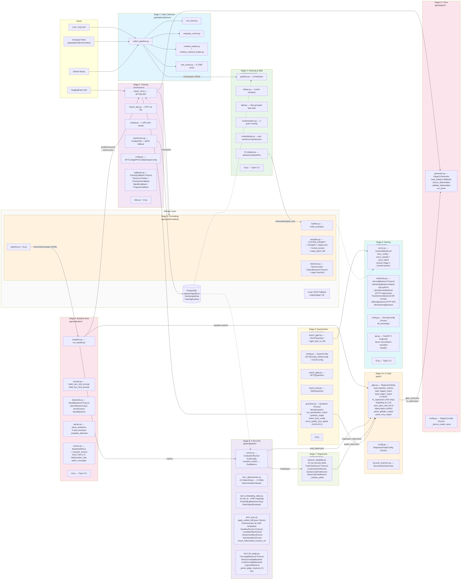

---

## 🔌 2. Injectable Backend Pattern (Across All Stages)

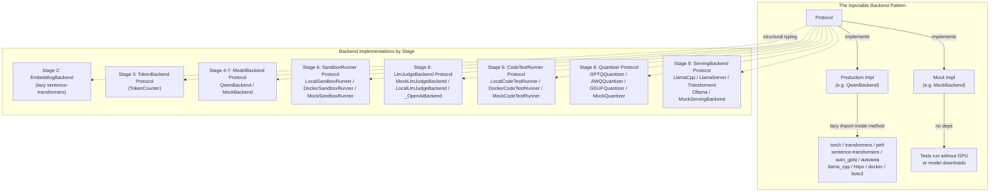

---

## ⚖️ 3. Four-Tier Evaluation Escalation (Stage 6)

```mermaid
flowchart TD
    T1["Tier 1: Deterministic<br/>(app/evaluation/tier1_deterministic.py)<br/><br/>DeterministicEvaluator<br/>• PatternRule dataclass (frozen)<br/>• DEFAULT_TIER1_RULES: 22 rules across 6 CWEs<br/>  — CWE-89: 5 patterns (f-string, concat, printf-style, SELECT, f'SELECT)<br/>  — CWE-79: 4 patterns (innerHTML, outerHTML, document.write, .send concat)<br/>  — CWE-22: 2 patterns (open() with +, open(var,))<br/>  — CWE-78: 4 patterns (shell=True, os.system, os.popen, subprocess+concat)<br/>  — CWE-190: 4 patterns (bytearray, (0)*, <<, multiplication)<br/>  — CWE-502: 3 patterns (pickle.loads, yaml.load, yaml.load+Loader)<br/>• Confidence: 0.55–0.99<br/>• evaluate(sample) → Tier1Result<br/>  (predicted_cwe, confidence, matched_pattern, num_matched)<br/><br/>Output: Tier1Result"]

    T2["Tier 2: Static Signal + Embedding<br/>(app/evaluation/tier2_embedding_static.py)<br/><br/>StaticSignalEvaluator<br/>• DEFAULT_RULE_TO_CWE: 19 semgrep rule→CWE mappings<br/>• Vote across findings → predicted_cwe<br/>• EmbeddingBackend (lazy sentence-transformers)<br/>  intfloat/multilingual-e5-base<br/>• cosine similarity: predicted patch vs gold fix<br/>• _cosine_similarity (pure Python)<br/>• evaluate(sample, prediction) → Tier2Result<br/>  (signal_sources, embedding_similarity)<br/><br/>Output: Tier2Result"]

    T3["Tier 3: Exec Sandbox<br/>(app/evaluation/tier3_exec.py)<br/><br/>ExecEvaluator<br/>• apply_unified_diff(source, diff)<br/>  — Pure Python (no git/patch dep)<br/>  — Brace-matching parser for @@ hunks<br/>  — Context verification + error messages<br/>• _TEST_TEMPLATES: 6 per-CWE test templates (AST-based)<br/>  — CWE-89: ast.parse, check no JoinedStr in .execute()<br/>  — CWE-79: check no innerHTML/outerHTML/document.write<br/>  — CWE-22: check realpath/abspath + startswith/commonpath<br/>  — CWE-78: check no shell=True/os.system/os.popen<br/>  — CWE-190: check OverflowError/raise/if guard<br/>  — CWE-502: ast.walk, check no pickle/unsafe yaml.load<br/>• SandboxRunner(Protocol)<br/>  — LocalSandboxRunner: subprocess, temp dir<br/>  — DockerSandboxRunner: --read-only --network none<br/>    user UID 1000, 512MB mem limit<br/>  — MockSandboxRunner: canned results<br/>• check_hallucinated_function_ref(code, patch)<br/>• evaluate(sample, prediction) → ExecEvalResult<br/>  (patch_applies, build_succeeds,<br/>tests_pass, hallucinated_cwe,<br/>hallucinated_function_ref)<br/><br/>Output: ExecEvalResult"]

    T4["Tier 4: LLM Judge<br/>(app/evaluation/tier4_llm_judge.py)<br/><br/>LlmJudge<br/>• JUDGE_PROMPT template:<br/>  CWE + description + vuln_code<br/>  + patch_diff + rationale →<br/>  JSON: {explanation_quality, patch_minimality, rationale}<br/>• _parse_judge_response (3-tier fallback):<br/>  1. strict json.loads<br/>  2. _find_json_objects brace-matching<br/>  3. regex extraction for truncated JSON<br/>• LlmJudgeBackend(Protocol)<br/>  — MockLlmJudgeBackend (default 0.5/0.5)<br/>  — LocalLlmJudgeBackend (HF model)<br/>  — _OpenAiBackend (OpenAI-compatible API)<br/>• evaluate(sample, prediction) → LlmJudgeScore<br/><br/>Output: LlmJudgeScore"]

    T1 -->|"samples"| T2
    T2 -->|"samples + predictions"| T3
    T3 -->|"samples + predictions"| T4
    T4 -->|"aggregate all tiers"| METRICS["compute_metrics (runner.py)<br/>→ EvalMetrics / EvalReport<br/><br/>Metrics:<br/>• tier1_cwe_macro_f1 / coverage<br/>• tier2_cwe_macro_f1 / coverage<br/>• model_cwe_macro_f1<br/>• exec_pass_rate / patch_applies_rate<br/>• build_succeeds_rate<br/>• hallucination_rate<br/>• avg_patch_coverage<br/>• avg_explanation_quality (T4)<br/>• avg_patch_minimality (T4)<br/>• per_class F1<br/><br/>Output: eval_report.json"]

    style T1 fill:#e3f2fd
    style T2 fill:#e8f5e9
    style T3 fill:#fff3e0
    style T4 fill:#f3e5f5
    style METRICS fill:#ede7f6
```

---

## 🛠️ 4. Stage 4: Baseline Evaluation (Detailed)

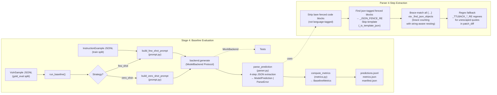

**Files:**
| File | Key Functions/Classes |
|------|----------------------|
| `app/evaluation/baseline.py` | `run_baseline()`, `BaselineConfig`, `BaselineResult` |
| `app/evaluation/prompt.py` | `build_zero_shot_prompt()`, `build_few_shot_prompt()`, `RESPONSE_FORMAT_INSTRUCTION` (reuses `format_prompt` from Stage 3) |
| `app/evaluation/backends.py` | `ModelBackend` Protocol, `QwenBackend` (lazy `transformers`+`peft`), `MissingAdapterWeightsError`, `MockBackend` |
| `app/evaluation/parser.py` | `parse_prediction()`, `ParseError`, `_extract_json`, `_find_json_objects`, `_is_template_json`, `_try_fallback_extract` |
| `app/evaluation/metrics.py` | `BaselineMetrics`, `compute_metrics()` (baseline-specific: `cwe_macro_f1`, `cwe_micro_accuracy`, `severity_accuracy`, `hallucination_rate`, `patch_coverage`) |
| `app/evaluation/cli.py` | Typer CLI for baseline runs |

**Critical Fix — `MissingAdapterWeightsError`:**
When a LoRA adapter directory has `adapter_config.json` but no `adapter_model.safetensors`/`.bin`, the `QwenBackend` raises this error by default instead of silently falling back to the base model. This prevents a false `forgetting_delta == 0.0` in Stage 7. Callers must explicitly set `allow_base_fallback=True` to skip this guard.

---

## 🏋️ 5. Stage 5: Fine-Tuning (SFT / QLoRA / LoRA / DPO)

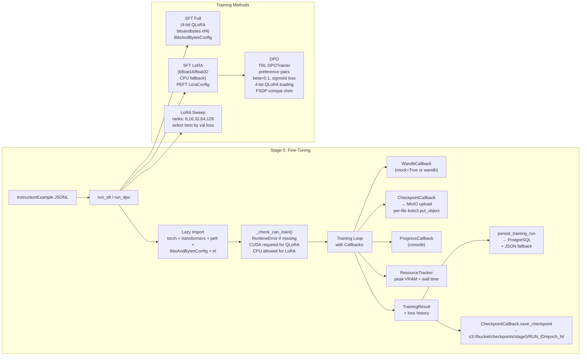

**Files:**
| File | Key Classes/Functions |
|------|----------------------|
| `app/training/trainer_sft.py` | `SFTConfig`, `_run_sft`, `run_sft`, QLoRA with `BitsAndBytesConfig(nf4)`, CPU fallback, `dry_run` mode |
| `app/training/trainer_dpo.py` | `DPOConfig`, `_run_dpo`, `run_dpo` (TRL `DPOTrainer`), preference pair construction |
| `app/training/sweep.py` | `SweepConfig`, `run_sweep` (LoRA ranks 8-128), `SweepResult` |
| `app/training/experiment.py` | `persist_training_run()` (PostgreSQL `TrainingRunRow` + JSON fallback) |
| `app/training/config.py` | `SFTConfig`, `DPOConfig`, `SweepConfig` dataclasses |
| `app/training/callbacks.py` | `TrainingCallback` Protocol, `ResourceTracker`, `CheckpointCallback`→MinIO, `WandbCallback`, `ProgressCallback` |
| `app/training/data.py` | `load_examples()`, `JsonlDataLoader` |
| `app/training/cli.py` | Typer CLI for SFT/DPO/sweep |

---

## 📦 6. Storage Layer — PostgreSQL + MinIO / S3 Split

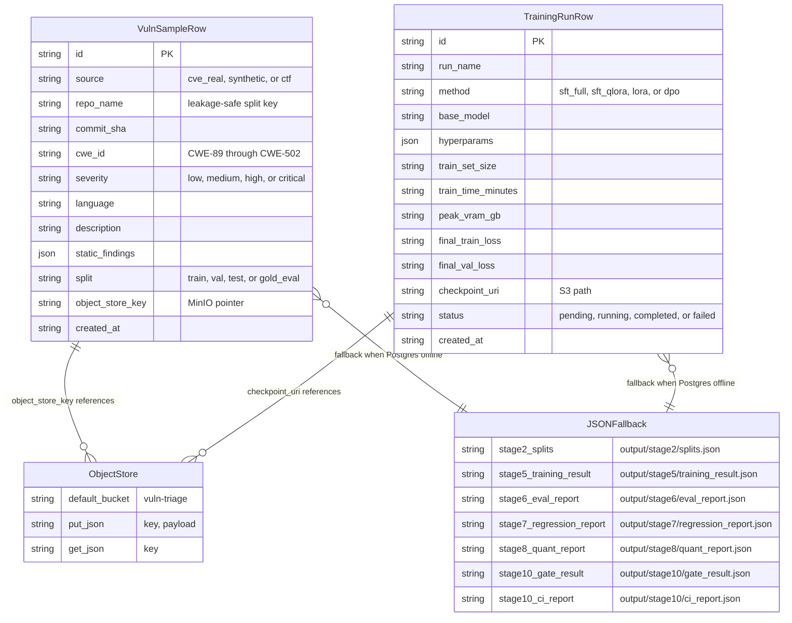

**Schema Contracts** (`app/schemas/`):

| File | Models |
|------|--------|
| `vuln.py` | `VulnSample`, `StaticFinding` |
| `dataset.py` | `InstructionExample` |
| `prediction_eval.py` | `ModelPrediction`, `Tier1Result`, `Tier2Result`, `ExecEvalResult`, `LlmJudgeScore`, `EvalMetrics`, `EvalReport`, `GeneralCapabilityResult`, `GeneralCapabilityMetrics`, `RegressionReport`, `RegressionSummary` |
| `training.py` | `TrainingRun`, `TrainingResult`, `SweepResult` |
| `quantization.py` | `QuantMethod` (StrEnum), `QuantStatus`, `QuantResult`, `QuantReport`, `QuantRecommendation` |
| `serving.py` | `ServeRequest`, `ServeResponse`, `BatchServeRequest`, `BatchServeResponse`, `ServeManifest` |
| `ci.py` | `GateStatus`, `GateCheck`, `RegressionGateResult`, `SecurityScanSummary`, `CiReport` |
| `documentation.py` | `CWE_SCOPE`, `LANGUAGE_SCOPE`, `BASE_MODEL`, `EvalMetricsSnapshot`, `TrainingRunData`, `QuantResultData`, `ModelCardData`, `TrainingReportData`, `DemoResult` |

**Key Design Decisions:**
- **Metadata in Postgres, payloads in S3:** Only queryable metadata (CWE, severity, repo_name, split) lives in the DB; full code payloads and model checkpoints live in MinIO/S3
- **JSON fallback everywhere:** Every stage writes JSON to `output/stageN/` as a file-based fallback when Postgres is unavailable
- **Leakage-safe splits:** Grouping by `repo_name` (not individual samples) prevents the same repository appearing in both train and test

---

## 🎯 7. Stage 7: Regression / Forgetting Analysis

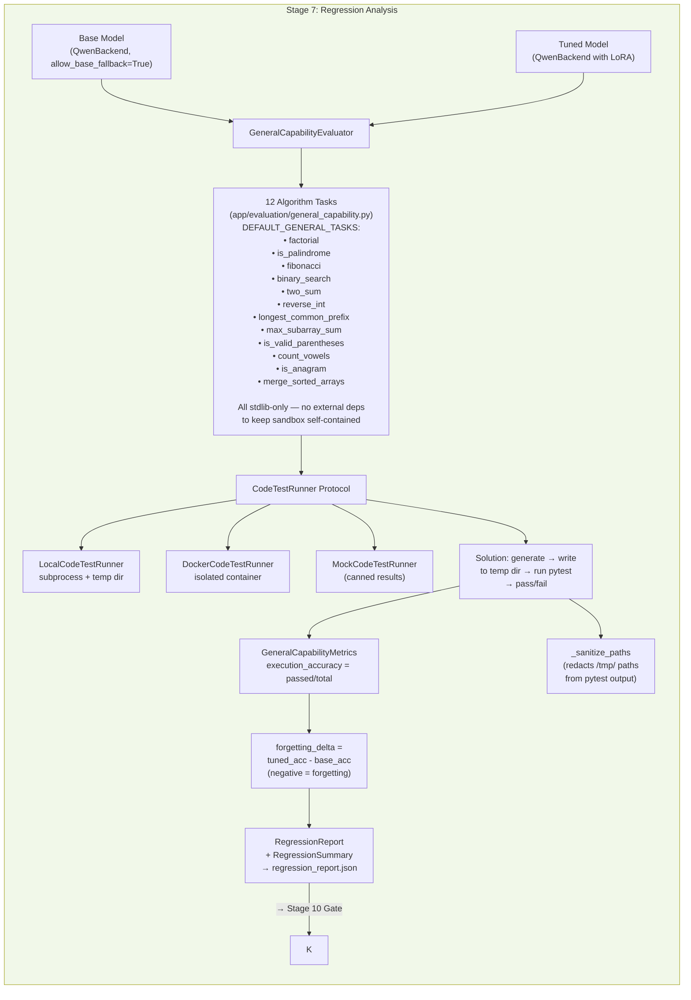

---

## ⚙️ 8. Stage 8: Quantization Matrix

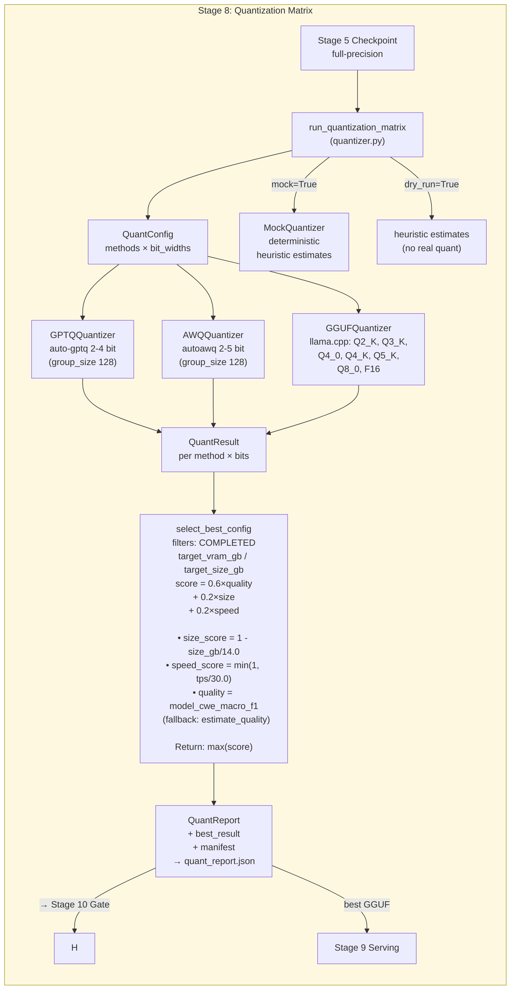

**Scoring Constants** (`quantizer.py`):
- `_QUALITY_WEIGHT = 0.6`
- `_SIZE_WEIGHT = 0.2`
- `_SPEED_WEIGHT = 0.2`

**Baseline normalization:** FP16 = 14 GB / ~30 t/s (7B model on GPU)

---

## 🚀 9. Stage 9: Air-Gapped Serving

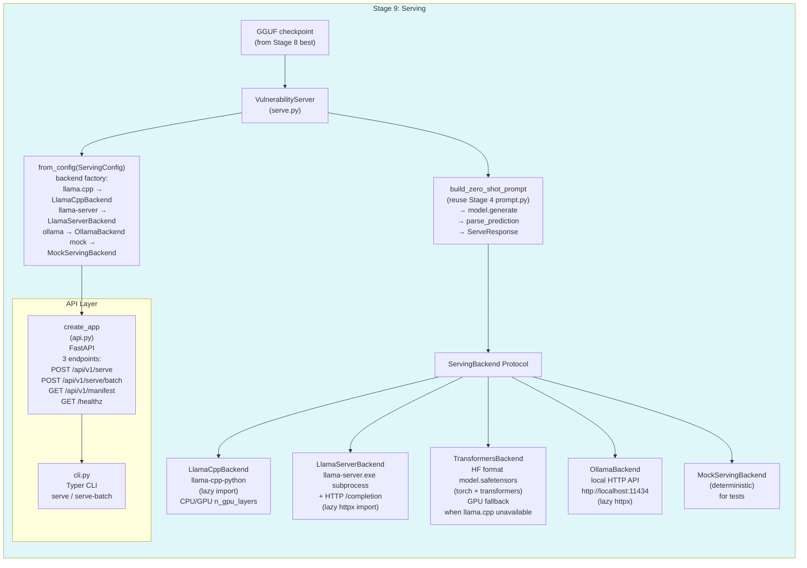

---

## 🚦 10. Stage 10: CI Regression Gate

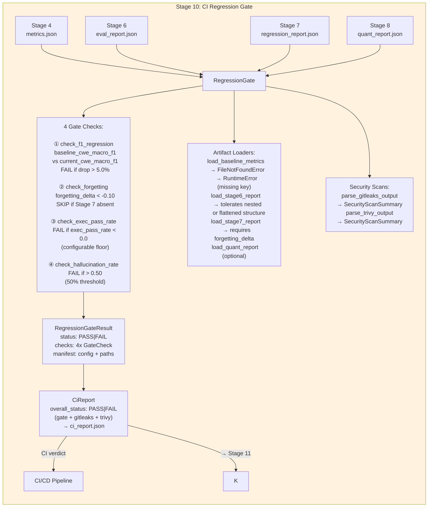

**Files:**
| File | Key Functions/Classes |
|------|----------------------|
| `app/ci/gate.py` | `RegressionGate` class, `run_gate()`, `load_baseline_metrics()`, `load_stage6_report()`, `load_stage7_report()`, `parse_gitleaks_output()`, `parse_trivy_output()` |
| `app/ci/config.py` | `RegressionGateConfig` (frozen dataclass with threshold defaults) |
| `app/ci/security_scanners.py` | Gitleaks + Trivy output parsers → `SecurityScanSummary` |

**Schema** (`app/schemas/ci.py`): `GateStatus` (StrEnum: PASS/FAIL/SKIP), `GateCheck` (name, status, message, details), `RegressionGateResult` (status, run_id, timestamp, baseline/current F1, f1_drop_percent, exec_pass_rate, hallucination_rate, forgetting_delta, checks, manifest), `SecurityScanSummary` (tool, status, findings_count, severity_counts), `CiReport` (run_id, gate, gitleaks, trivy, overall_status)

---

## 📄 11. Stage 11: Documentation Generation

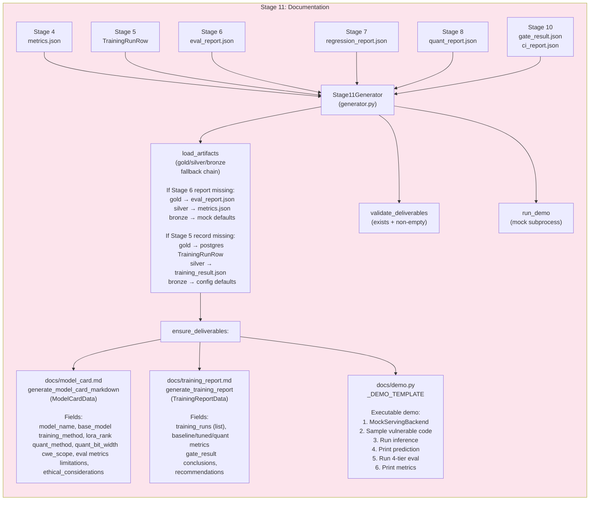

---

## 📋 12. Test Coverage Matrix

```mermaid
graph LR
    subgraph Tests["Test Suites"]
        subgraph Unit["tests/unit/"]
            U1["test_evaluation_backends.py<br/>MockBackend response mapping<br/>MockBackend call tracking<br/>QwenBackend constructor storage<br/>Lazy loading behavior<br/>MissingAdapterWeightsError<br/>adapter_applied flag<br/>Protocol compatibility"]

            U2["test_evaluation_runner.py<br/>_compute_cwe_macro_f1 edge cases<br/>_compute_coverage<br/>EvaluationRunner tier injection<br/>Sandbox modes: local/docker/mock<br/>load_samples / load_predictions<br/>run() end-to-end with mocks"]

            U3["test_evaluation_parser.py<br/>parse_prediction<br/>_is_template_json<br/>_extract_json<br/>_find_json_objects<br/>_try_fallback_extract<br/>ParseError handling"]

            U4["test_evaluation_metrics.py<br/>BaselineMetrics fields<br/>compute_metrics<br/>per-class F1<br/>hallucination rate<br/>patch coverage"]

            U5["test_evaluation_prompt.py<br/>build_zero_shot_prompt<br/>build_few_shot_prompt<br/>RESPONSE_FORMAT_INSTRUCTION<br/>format_prompt reuse"]

            U6["test_tier1_deterministic.py<br/>PatternRule matching<br/>confidence ranking<br/>no-match → None<br/>DEFAULT_TIER1_RULES count<br/>classify_deterministic"]

            U7["test_tier2_embedding_static.py<br/>DEFAULT_RULE_TO_CWE mapping<br/>Semgrep vote → CWE<br/>EmbeddingBackend lazy load<br/>_cosine_similarity<br/>StaticSignalEvaluator.evaluate"]

            U8["test_tier3_exec.py<br/>apply_unified_diff<br/>_parse_diff_hunks<br/>_find_first_mismatch<br/>_TEST_TEMPLATES (6 CWEs)<br/>TestGenerator<br/>sandbox modes<br/>check_hallucinated_function_ref<br/>LocalSandboxRunner<br/>MockSandboxRunner"]

            U9["test_tier4_llm_judge.py<br/>JUDGE_PROMPT formatting<br/>_parse_judge_response<br/>3-tier fallback:<br/>  strict JSON → brace-match → regex<br/>MockLlmJudgeBackend<br/>LlmJudge.invoke / evaluate<br/>_OpenAiBackend fallback"]

            U10["test_baseline.py<br/>run_baseline<br/>BaselineConfig<br/>BaselineResult<br/>parse_errors<br/>MockBackend injection"]

            U11["test_vulnerability_server.py<br/>VulnerabilityServer.serve_sample<br/>serve_batch<br/>from_config<br/>MockServingBackend<br/>parse_prediction integration"]

            U12["test_serving_backends.py<br/>LlamaCppBackend._load<br/>mock mode<br/>generate output parsing<br/>LlamaServerBackend lifecycle<br/>OllamaBackend<br/>TransformersBackend<br/>MockServingBackend<br/>ServingBackend Protocol<br/>_import_httpx<br/>_find_hf_model_dir<br/>_find_llama_server"]

            U13["test_serving_config.py<br/>ServingConfig validation<br/>all_warnings<br/>boundary conditions<br/>backend_type validation"]

            U14["test_quantization.py<br/>Quantizer Protocol<br/>MockQuantizer<br/>quantize_single<br/>dry_run / mock modes<br/>select_best_config filters<br/>score_quality_size_speed<br/>_NoOpQuantizer"]

            U15["test_stage10_gate.py<br/>RegressionGate<br/>4 checks:<br/>  check_f1_regression<br/>  check_forgetting (SKIP)<br/>  check_exec_pass_rate<br/>  check_hallucination_rate<br/>load_baseline/stage6/stage7<br/>parse_gitleaks_output<br/>parse_trivy_output<br/>RegressionGateConfig (frozen)<br/>run_gate end-to-end"]

            U16["test_training_trainer_sft.py<br/>_check_can_train<br/>dry_run mode<br/>TrainingResult<br/>ResourceTracker<br/>Config validation<br/>Callback injection"]

            U17["test_training_trainer_dpo.py<br/>DPOTrainer integration<br/>Preference pair construction<br/>FSDP shim<br/>TrainingResult fields"]

            U18["test_training_callbacks.py<br/>WandbCallback mock mode<br/>CheckpointCallback mock → MinIO<br/>ProgressCallback<br/>ResourceTracker VRAM<br/>TrainingCallback Protocol"]

            U19["test_training_experiment.py<br/>persist_training_run<br/>PostgreSQL + JSON fallback<br/>TrainingRunRow mapping<br/>load_training_run"]

            U20["test_general_capability.py<br/>DEFAULT_GENERAL_TASKS (12)<br/>_gc_task constructor<br/>CodeTestRunner Protocol<br/>LocalCodeTestRunner<br/>subprocess safety (_sanitize_paths)<br/>MockCodeTestRunner<br/>forgetting_delta calc"]

            U21["test_stage11_documentation.py<br/>Stage11Config (frozen)<br/>_derive_model_name<br/>generate_model_card_markdown<br/>generate_training_report<br/>generate_demo_script<br/>load_artifacts fallback chain<br/>ensure_deliverables<br/>validate_deliverables<br/>run_demo (mocked<br/>subprocess)"]
        end

        subgraph Integration["tests/integration/"]
            I1["test_stage1_pipeline.py<br/>CVE → Semgrep → DB"]
            I2["test_stage2_pipeline.py<br/>Dedup + split + contaminate"]
            I3["test_stage3_pipeline.py<br/>VulnSample → InstructionExample"]
            I4["test_stage4_baseline.py<br/>End-to-end baseline<br/>with MockBackend"]
            I5["test_stage5_training.py<br/>dry_run SFT/QLoRA/DPO<br/>training_result.json<br/>Loss curve generation"]
            I6["test_stage6_four_tier.py<br/>EvaluationRunner<br/>all 4 tiers<br/>EvalReport output<br/>compute_metrics"]
            I7["test_stage7_regression.py<br/>GeneralCapabilityEvaluator<br/>forgetting analysis<br/>LocalCodeTestRunner"]
            I8["test_stage8_quantization.py<br/>QuantizationMatrix<br/>QuantReport<br/>select_best_config<br/>dry_run estimation"]
            I9["test_stage9_serving.py<br/>VulnerabilityServer<br/>end-to-end<br/>MockServingBackend<br/>ServeResponse"]
            I10["test_stage10_ci.py<br/>RegressionGate end-to-end<br/>CiReport<br/>SecurityScanSummary<br/>GateCheck statuses"]
            I11["test_stage11_docs.py<br/>Stage11Generator<br/>all 3 deliverables<br/>File existence + content"]
        end

        subgraph CodeQuality["tests/code_quality/"]
            CQ1["test_mypy_types.py<br/>mypy strict checks"]
            CQ2["test_type_coverage.py<br/>type annotation coverage"]
        end
    end

    style Tests fill:#f5f5f5
```

---

## 🔒 13. Security Patterns

| Pattern | Location | `# nosec` Code | Why it's safe |
|---------|----------|---------------|---------------|
| Subprocess with `sys.executable` + temp files | `tier3_exec.py`, `general_capability.py` | `B603` (run) / `B404` (import) | Inputs are `sys.executable` (system Python) and temp file paths created by the code itself — attacker doesn't control the path or args |
| `random.Random` for split seeding | `split.py` | `B311` | Deterministic MD5 hash-based split, not security-sensitive |
| Enum string values flagged as hardcoded | `ci.py` | `B105` | These are enum literals for `PASS`/`FAIL`/`SKIP`, not passwords |
| `open()` on local paths | `object_store.py`, templates | `B108` | Paths are under `/tmp/` with test-controlled names |
| `transformers` remote model load | `backends.py` | `B615` | Models loaded from pinned HuggingFace tags, not arbitrary URLs |

---

## 🧩 14. Lazy Import Map

```mermaid
graph LR
    subgraph LazyImports["Heavy ML Dependencies — All Lazy-Loaded"]
        subgraph L1["Stage 2"]
            LI1["embeddings.py<br/>→ sentence-transformers"]
        end
        subgraph L2["Stage 3"]
            LI2["tokenizer.py<br/>→ transformers<br/>(AutoTokenizer)"]
        end
        subgraph L3["Stage 4"]
            LI3["backends.py<br/>→ transformers + peft<br/>(QwenBackend._load)"]
        end
        subgraph L4["Stage 5"]
            LI4A["trainer_sft.py<br/>→ torch + transformers<br/>+ peft + bitsandbytes"]
            LI4B["trainer_dpo.py<br/>→ trl + transformers<br/>+ peft"]
            LI4C["callbacks.py<br/>→ torch.cuda<br/>(wandb lazy)"]
            LI4D["experiment.py<br/>→ sqlalchemy (always)<br/>+ psycopg2 (always)"]
        end
        subgraph L5["Stage 6 Tier 2"]
            LI5["tier2_embedding_static.py<br/>→ sentence-transformers<br/>(EmbeddingBackend)"]
        end
        subgraph L6["Stage 6 Tier 4"]
            LI6["tier4_llm_judge.py<br/>→ torch (LocalLlmJudgeBackend)<br/>+ openai (_OpenAiBackend)"]
        end
        subgraph L7["Stage 6 Tier 3"]
            LI7a["tier3_exec.py<br/>→ docker (DockerSandboxRunner)"]
            LI7b["tier3_exec.py<br/>→ subprocess (always)<br/>+ pytest (runtime)"]
        end
        subgraph L8["Stage 7"]
            LI8a["general_capability.py<br/>→ subprocess (always)<br/>+ pytest (runtime)"]
            LI8b["general_capability.py<br/>→ docker (DockerCodeTestRunner)"]
        end
        subgraph L9["Stage 9"]
            LI9a["backends.py<br/>→ llama_cpp (LlamaCppBackend)"]
            LI9b["backends.py<br/>→ httpx (LlamaServerBackend<br/>+ OllamaBackend)"]
            LI9c["backends.py<br/>→ torch + transformers<br/>(TransformersBackend)"]
        end
        subgraph L10["Stage 8"]
            LI10a["export_gptq.py<br/>→ auto_gptq + torch"]
            LI10b["export_awq.py<br/>→ autoawq + torch"]
            LI10c["export_gguf.py<br/>→ llama_cpp or<br/>subprocess + llama.cpp CLI"]
        end
    end

    subgraph AlwaysLoaded["Always Loaded (at import time)"]
        AL1["boto3 (storage/object_store.py)"]
        AL2["pydantic (all schemas)"]
        AL3["fastapi + uvicorn (api.py)"]
        AL4["sqlalchemy (storage/db.py)"]
        AL5["typer (all CLI modules)"]
    end

    style LazyImports fill:#fff9c4
    style AlwaysLoaded fill:#bbdefb
```

---

## 🗺️ 15. Dependency Flow Diagram

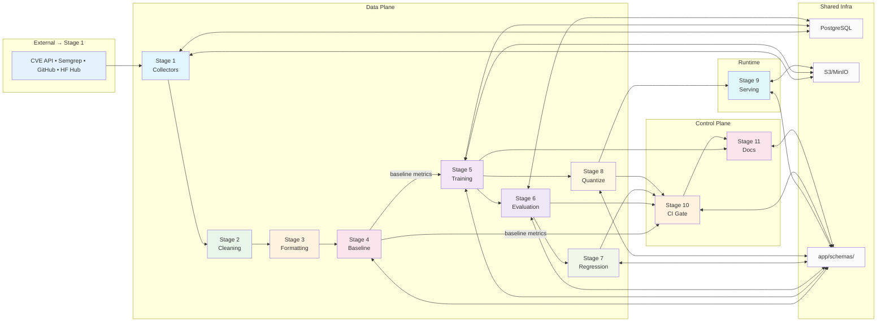
